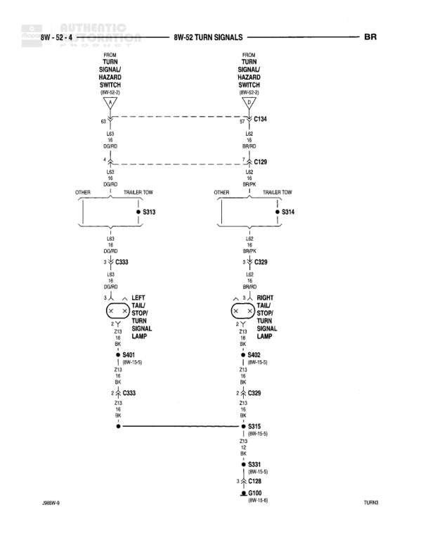

# TURN SIGNALS

**Notes:** Turn signal circuits split to handle trailer tow and other accessories. Left circuit uses L43 (DG/RD), right circuit uses L42 (BR/PK). Both share common ground path through G100. J0BW-9 marking indicates diagram revision or vehicle application.

## Components

| Component | Ref | Connectors | Notes |
|-----------|-----|------------|-------|
| TURN SIGNAL/MULTIFUNCTION SWITCH | 8W-52-3 | C104, C129 | Left side circuit |
| TURN SIGNAL/MULTIFUNCTION SWITCH | 8W-52-3 | C104, C129 | Right side circuit |
| LEFT TAIL/STOP/TURN SIGNAL LAMP | None |  | Left rear combination lamp |
| RIGHT TAIL/STOP/TURN SIGNAL LAMP | None |  | Right rear combination lamp |

## Wires

| From | To | Wire Code | Gauge | Color | Notes |
|------|-----|-----------|-------|-------|-------|
| TURN SIGNAL/MULTIFUNCTION SWITCH (8W-52-3) C104-6 | Splice CS33 | L43 | 18 | DG/RD | Left signal circuit |
| Splice CS33 | OTHER | L43 | 18 | DG/RD | None |
| Splice CS33 | TRAILER TOW | L43 | 18 | DG/RD | None |
| Splice CS33 | Splice CS33 (continuation) | L43 | 18 | DG/RD | None |
| Splice CS33 (continuation) | LEFT TAIL/STOP/TURN SIGNAL LAMP Z10 | L8 | 18 | DG/RD | None |
| LEFT TAIL/STOP/TURN SIGNAL LAMP Z11 | Splice S401 (8W-10-6) | Z1 | 18 | BK | None |
| Splice S401 | Splice CS33 (ground path) | Z1 | 18 | BK | None |
| TURN SIGNAL/MULTIFUNCTION SWITCH (8W-52-3) C104-5 | Splice C129 | L42 | 16 | BR/PK | Right signal circuit |
| Splice C129 | OTHER | L42 | 16 | BR/PK | None |
| Splice C129 | TRAILER TOW | L42 | 16 | BR/PK | None |
| Splice C129 | Splice CS29 (continuation) | L42 | 16 | BR/PK | None |
| Splice CS29 | RIGHT TAIL/STOP/TURN SIGNAL LAMP Z10 | L8 | 18 | BR/PK | None |
| RIGHT TAIL/STOP/TURN SIGNAL LAMP Z11 | Splice S402 (8W-10-8) | Z1 | 18 | BK | None |
| Splice S402 | Splice CS29 (ground path) | Z1 | 18 | BK | None |
| Splice CS29 | Splice S315 (8W-10-9) | Z13 | 12 | BK | None |
| Splice S315 | Splice S331 (8W-10-9) | Z13 | 12 | BK | None |
| Splice S331 | Splice C128 | Z1 | 12 | BK | None |
| Splice C128 | Ground G100 (8W-12-8) | Z1 | 12 | BK | None |
| Splice CS33 | Splice CS33 (ground path continuation) | Z13 | 12 | BK | None |

## Splices & Grounds

| ID | Type | Location | Wires Connected | Notes |
|----|------|----------|-----------------|-------|
| S313 | splice | Left circuit path to trailer tow and other | L43 | Splits left turn signal to multiple destinations |
| S314 | splice | Right circuit path to trailer tow and other | L42 | Splits right turn signal to multiple destinations |
| CS33 | splice | Left turn signal circuit | L43, L8 | Connects to left tail/stop/turn lamp |
| CS29 | splice | Right turn signal circuit | L42, L8 | Connects to right tail/stop/turn lamp |
| S401 | splice | Left lamp ground path (8W-10-6) | Z1 | Ground splice for left lamp |
| S402 | splice | Right lamp ground path (8W-10-8) | Z1 | Ground splice for right lamp |
| S315 | splice | Ground consolidation point (8W-10-9) | Z13 | Intermediate ground splice |
| S331 | splice | Ground consolidation point (8W-10-9) | Z13, Z1 | Intermediate ground splice |
| C128 | splice | Ground path to G100 | Z1 | In-line connector before ground point |
| G100 | ground | 8W-12-8 |  | Main ground point for turn signal circuits |

## Cross-References

- 8W-52-3
- 8W-10-6
- 8W-10-8
- 8W-10-9
- 8W-12-8
