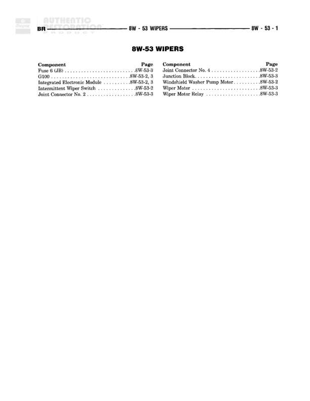

# 8W-53 WIPERS

**Notes:** This is an index/table of contents page for the 8W-53 WIPERS diagram series. It lists all components and their locations across pages 8W-53-2 and 8W-53-3. No actual wiring connections are shown on this page.

## Components

| Component | Ref | Connectors | Notes |
|-----------|-----|------------|-------|
| Fuse 5 (JB) | 8W-53-2 |  | Junction Block fuse reference |
| C100 | 8W-53-2, 3 | C100 | Connector referenced on pages 2 and 3 |
| Integrated Electronic Module | 8W-53-2, 3 |  | Referenced on pages 2 and 3 |
| Intermittent Wiper Switch | 8W-53-2 |  | Wiper control switch |
| Joint Connector No. 2 | 8W-53-3 |  | Joint connector reference |
| Joint Connector No. 4 | 8W-53-2 |  | Joint connector reference |
| Junction Block | 8W-53-3 |  | Main junction block |
| Windshield Washer Pump Motor | 8W-53-2 |  | Washer pump motor |
| Wiper Motor | 8W-53-3 |  | Windshield wiper motor |
| Wiper Motor Relay | 8W-53-3 |  | Relay for wiper motor control |

## Cross-References

- 8W-53-2
- 8W-53-3
