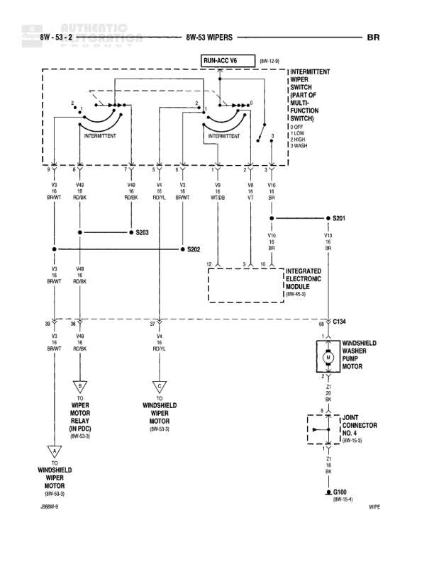

# WIPERS

**Notes:** Wiring diagram for windshield wiper system including intermittent wiper switch, integrated electronic module, wiper motor relay, and washer pump. System includes connections marked as BR (continuation reference).

## Components

| Component | Ref | Connectors | Notes |
|-----------|-----|------------|-------|
| RUN-ACC V6 | 8W-10-10 |  | Power feed from run-acc circuit |
| INTERMITTENT WIPER SWITCH (PART OF MULTI-FUNCTION SWITCH) | 8W-53-2 |  | LOW, INT, HIGH settings |
| INTEGRATED ELECTRONIC MODULE | 8W-52-5 | V12, V11 |  |
| WINDSHIELD WASHER PUMP MOTOR | 8W-53-3 |  |  |
| WIPER MOTOR RELAY (IN PDC) | 8W-53-4 |  |  |
| WINDSHIELD WIPER MOTOR | 8W-53-3 | C134 |  |
| JOINT CONNECTOR | 8W-15-9 |  |  |

## Wires

| From | To | Wire Code | Gauge | Color | Notes |
|------|-----|-----------|-------|-------|-------|
| RUN-ACC V6 | INTERMITTENT switch pin 3 | V2 | 18 | BR/WT |  |
| INTERMITTENT switch pin 1 | S203 | V49 | 18 | RD/BK |  |
| INTERMITTENT switch pin 2 | S203 | V49 | 18 | RD/BK |  |
| INTERMITTENT switch pin 4 | S202 | V4 | 18 | RD/YL |  |
| INTERMITTENT switch pin 5 | INTEGRATED ELECTRONIC MODULE V8 | V3 | 18 | BR/WT |  |
| INTERMITTENT switch pin 6 | INTEGRATED ELECTRONIC MODULE V9 | V9 | 18 | WT/DB |  |
| INTERMITTENT switch pin 7 | INTEGRATED ELECTRONIC MODULE V8 | V8 | 18 | VT |  |
| INTERMITTENT switch pin 8 | S301 | V10 | 18 | BR |  |
| S203 | WIPER MOTOR RELAY pin 30 | V49 | 18 | RD/BK |  |
| S203 | WINDSHIELD WIPER MOTOR pin 38 | V49 | 18 | RD/BK |  |
| S202 | WINDSHIELD WIPER MOTOR pin 37 | V4 | 18 | RD/YL |  |
| S301 | INTEGRATED ELECTRONIC MODULE V11 | V11 | 18 | BR |  |
| INTEGRATED ELECTRONIC MODULE V12 | C134 pin 48 | V12 | 18 | VT |  |
| C134 pin 48 | WINDSHIELD WASHER PUMP MOTOR pin 1 | V12 | 18 | VT |  |
| WINDSHIELD WASHER PUMP MOTOR pin 2 | JOINT CONNECTOR | Z1 | 20 | BK |  |
| JOINT CONNECTOR | G100 | Z1 | 20 | BK |  |
| WIPER MOTOR RELAY pin 87 | WINDSHIELD WIPER MOTOR | V2 | 18 | BR/WT |  |
| WINDSHIELD WIPER MOTOR | G100 | Z1 | 20 | BK |  |

## Splices & Grounds

| ID | Type | Location | Wires Connected | Notes |
|----|------|----------|-----------------|-------|
| S203 | splice | Between intermittent switch and wiper components | V49 | Connects to wiper motor relay and windshield wiper motor |
| S202 | splice | Between intermittent switch and windshield wiper motor | V4 |  |
| S301 | splice | Between intermittent switch and integrated electronic module | V10, V11 |  |
| G100 | ground | 8W-15-6 |  | Common ground point for wiper motor and washer pump |

## Cross-References

- 8W-53-2
- 8W-10-10
- 8W-52-5
- 8W-53-3
- 8W-53-4
- 8W-15-9
- 8W-15-6
