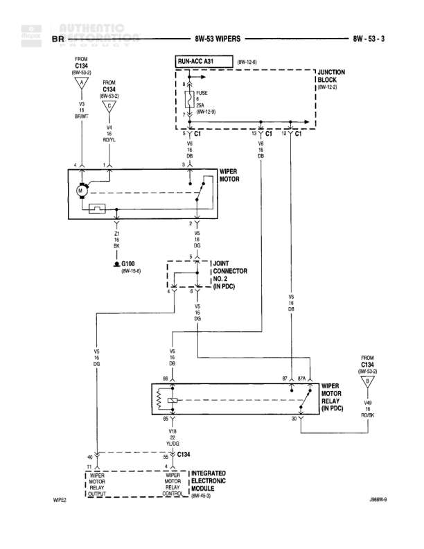

# WIPERS

**Notes:** This diagram shows the complete wiper motor circuit including relay control through the Integrated Electronic Module. The system uses a relay in the PDC with dual paths for park position and run operation. Power is sourced from RUN-ACC A31 and controlled via the IEM. Joint Connector No. 2 provides connection paths between the wiper motor and relay.

## Components

| Component | Ref | Connectors | Notes |
|-----------|-----|------------|-------|
| RUN-ACC A31 | 8W-12-6 |  | Run-Accessory power source |
| JUNCTION BLOCK | 8W-10-2 |  | Contains fuses and circuits |
| WIPER MOTOR | local | 1, 2, 3 | Three-wire wiper motor assembly |
| JOINT CONNECTOR NO. 2 (IN PDC) | local | A, B | Located in Power Distribution Center |
| WIPER MOTOR RELAY (IN PDC) | local | 85, 86, 87, 87A, 30 | Standard automotive relay in PDC |
| WIPER MOTOR RELAY CONTROL | 8W-60-5 |  | Control circuit for relay |
| INTEGRATED ELECTRONIC MODULE | 8W-60-3 |  | Central control module |
| FROM C134 | 8W-53-2 and 8W-10-2 | C134 | Power feed connector |

## Wires

| From | To | Wire Code | Gauge | Color | Notes |
|------|-----|-----------|-------|-------|-------|
| RUN-ACC A31 (8W-12-6) | 18 PNK FUSE | A31 | 18 | PK | To fuse in junction block |
| 18 PNK FUSE | JUNCTION BLOCK | A31 | 18 | PK | 8W-12-6 |
| FROM C134 (8W-53-2) | WIPER MOTOR pin 1 | V4 | 18 | VT | Brown wire |
| FROM C134 (8W-53-2) | WIPER MOTOR pin 2 | V4 | 18 | VT | RDYL (Red/Yellow) |
| WIPER MOTOR pin 3 | G100 (8W-12-6) | Z1 | 18 | BK | Ground connection |
| WIPER MOTOR pin 3 | JOINT CONNECTOR NO. 2 pin A | V5 | 18 | VT | Via dashed line to connector |
| JOINT CONNECTOR NO. 2 pin B | WIPER MOTOR RELAY pin 87 | V5 | 18 | VT | From connector to relay |
| WIPER MOTOR RELAY pin 30 | FROM C134 (8W-53-2) | V48 | 14 | VT | Power feed from C134, RDWT |
| WIPER MOTOR RELAY pin 86 | C134 | V18 | 18 | VT/WT | Via DG connection |
| C134 | WIPER MOTOR RELAY CONTROL (8W-60-5) | V18 | 18 | VT/WT | Control signal |
| WIPER MOTOR RELAY pin 85 | INTEGRATED ELECTRONIC MODULE (8W-60-3) | Z1 | 20 | BK | Ground return |
| WIPER MOTOR RELAY pin 87A | Joint Connector B | V6 | 18 | VT | Normally closed contact |
| Joint Connector B | Wiper Motor | V6 | 18 | VT | Return path |

## Splices & Grounds

| ID | Type | Location | Wires Connected | Notes |
|----|------|----------|-----------------|-------|
| G100 | ground | 8W-12-6 |  | Primary ground point for wiper motor |
| C134 | connector | Multiple connections shown | V4, V18, V48 | Central connector for wiper circuit, referenced from 8W-53-2 and 8W-10-2 |

## Cross-References

- 8W-12-6
- 8W-10-2
- 8W-53-2
- 8W-60-5
- 8W-60-3
