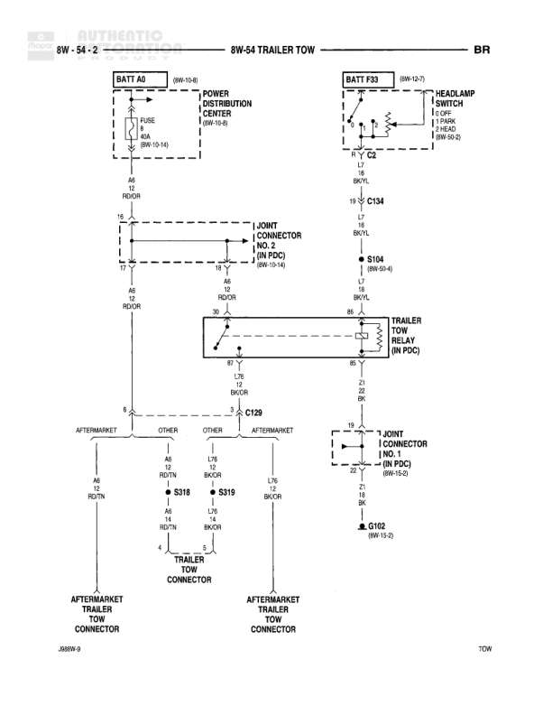

# TRAILER TOW

**Notes:** This diagram shows the trailer tow electrical system including power distribution, relay control, and connections to both factory and aftermarket trailer connectors. The system is powered through a 40A fuse and controlled via the headlamp switch with relay activation.

## Components

| Component | Ref | Connectors | Notes |
|-----------|-----|------------|-------|
| BATT A6 | 8W-10-6 |  | Battery feed source |
| POWER DISTRIBUTION CENTER | 8W-10-8 |  | Contains FUSE 40A |
| BATT F33 | 8W-12-7 |  | Battery feed for headlamp switch |
| HEADLAMP SWITCH | 8W-20-3 |  | Controls trailer tow lighting, 3 FUSES: 1-TRLR, 2-HEAD, 3-HEAD |
| TRAILER TOW RELAY | IN PDC |  | Located in Power Distribution Center |
| 4-JOINT CONNECTOR NO. 2 | IN PDC, 8W-10-4 | C134 | In Power Distribution Center |
| 7-JOINT CONNECTOR NO. 2 | IN PDC, 8W-10-4 |  | In Power Distribution Center |
| TRAILER TOW CONNECTOR | C129, C318, C319 | C129, C318, C319 | Multiple connectors for trailer interface |
| AFTERMARKET TRAILER TOW CONNECTOR | J&MW-9 |  | Two aftermarket connector points shown |

## Wires

| From | To | Wire Code | Gauge | Color | Notes |
|------|-----|-----------|-------|-------|-------|
| BATT A6 | FUSE 40A | A6 | None | None | Battery feed to fuse |
| FUSE 40A | 4-JOINT CONNECTOR NO. 2 (Pin 14) | A6 | 14 | RD/OR | None |
| 4-JOINT CONNECTOR NO. 2 (Pin 14) | 7-JOINT CONNECTOR NO. 2 (Pin 14) | A6 | 14 | RD/OR | None |
| 7-JOINT CONNECTOR NO. 2 (Pin 14) | TRAILER TOW RELAY (Pin 30) | A6 | 14 | RD/OR | None |
| BATT F33 | HEADLAMP SWITCH | F33 | None | None | Battery feed to headlamp switch |
| HEADLAMP SWITCH (Pin 11) | C134 (Pin 10) | L7 | 18 | BR/YL | None |
| C134 (Pin 10) | S104 | L7 | 18 | BR/YL | 8W-50-6 |
| S104 | TRAILER TOW RELAY (Pin 85) | L7 | 18 | BR/YL | None |
| TRAILER TOW RELAY (Pin 87) | TRAILER TOW RELAY (Pin 86) | Z1 | 18 | BK/OR | Ground connection |
| TRAILER TOW RELAY (Pin 87) | C129 (Pin 3) | Z1 | 18 | BK/OR | None |
| C129 (Pin 3) | 4-JOINT CONNECTOR NO. 2 (Pin 19) | Z1 | 18 | BK | None |
| 4-JOINT CONNECTOR NO. 2 (Pin 19) | G102 | Z1 | 18 | BK | 8W-13-2 |
| AFTERMARKET area | S318 | A6 | 18 | RD/TN | Aftermarket connection point |
| S318 | TRAILER TOW CONNECTOR | A6 | 18 | RD/TN | None |
| OTHER | S319 | L7B | 18 | BK/OR | None |
| S319 | TRAILER TOW CONNECTOR | L7B | 18 | BK/OR | None |

## Splices & Grounds

| ID | Type | Location | Wires Connected | Notes |
|----|------|----------|-----------------|-------|
| S104 | splice | 8W-50-6 | L7 | Connects headlamp switch to trailer tow relay |
| G102 | ground | 8W-13-2 |  | Ground point for trailer tow circuit |
| C129 | connector | Trailer tow relay to 4-joint connector | Z1, BK | 3-pin connector |
| C134 | connector | Between headlamp switch and S104 | L7 | Connects BR/YL wire |
| S318 | splice | Aftermarket trailer tow connector area | A6, RD/TN | Aftermarket connection point |
| S319 | splice | Aftermarket trailer tow connector area | L7B, BK/OR | Aftermarket connection point |

## Cross-References

- 8W-10-6
- 8W-10-8
- 8W-12-7
- 8W-20-3
- 8W-10-4
- 8W-50-6
- 8W-13-2
- 8W-54-1
