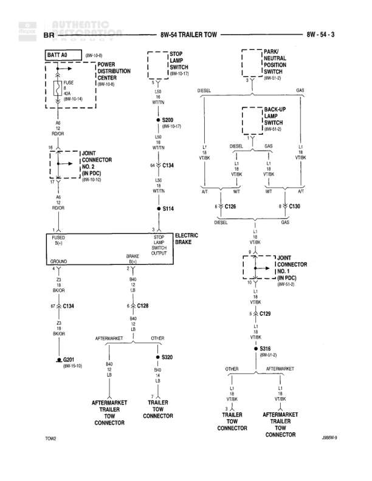

# TRAILER TOW

**Notes:** Trailer tow wiring diagram showing connections for 7-way connector, electric brake, stop lamps, and backup lamps. Includes separate paths for diesel/gas and manual/automatic transmission configurations. Supports both OEM and aftermarket trailer connectors.

## Components

| Component | Ref | Connectors | Notes |
|-----------|-----|------------|-------|
| BATT A0 | 8W-10-4 |  | Battery feed |
| POWER DISTRIBUTION CENTER | 8W-10-6 |  | PDC location |
| STOP LAMP SWITCH | 8W-10-13 |  | None |
| PARK/NEUTRAL POSITION SWITCH | 8W-43-2 |  | None |
| BACKUP LAMP SWITCH | 8W-51-5 |  | None |
| 7-WAY CONNECTOR NO. 2 (IN PDC) | 8W-10-6 |  | None |
| FUSES R41 | None |  | None |
| ELECTRIC BRAKE SWITCH | OUTPUT |  | None |
| 7 JOINT CONNECTOR (IN PDC) | 8W-61-2 |  | None |
| AFTERMARKET TRAILER TOW CONNECTOR | None |  | None |
| TRAILER TOW CONNECTOR | None |  | OEM trailer connector |

## Wires

| From | To | Wire Code | Gauge | Color | Notes |
|------|-----|-----------|-------|-------|-------|
| BATT A0 | POWER DISTRIBUTION CENTER | A0 | 6 | RD/OR | None |
| POWER DISTRIBUTION CENTER | 7-WAY CONNECTOR NO. 2 | A6 | 10 | RD/OR | None |
| 7-WAY CONNECTOR NO. 2 | C134 pin 5A | A6 | 10 | RD/OR | None |
| STOP LAMP SWITCH | S200 | L30 | 18 | WT/TN | DIESEL |
| STOP LAMP SWITCH | S200 | L30 | 18 | WT/TN | GAS |
| S200 | C134 | L30 | 18 | WT/TN | 8W-10-17 |
| C134 | S114 | L30 | 18 | WT/TN | None |
| PARK/NEUTRAL POSITION SWITCH | C126 | L1 | 20 | VT/BK | DIESEL |
| BACKUP LAMP SWITCH | C130 | L1 | 20 | VT/BK | GAS |
| C126 | M/T | L1 | 20 | VT/BK | DIESEL |
| C130 | A/T | L1 | 20 | VT/BK | GAS |
| M/T | 7 JOINT CONNECTOR | L1 | 14 | VT/BK | None |
| A/T | 7 JOINT CONNECTOR | L1 | 14 | VT/BK | None |
| 7 JOINT CONNECTOR | C129 pin 5 | L1 | 14 | VT/BK | None |
| ELECTRIC BRAKE SWITCH OUTPUT | S114 | None | None | BRAKE BLU | None |
| S114 | C134 pin 3 | BAG | 18 | LB | None |
| FUSES R41 | GROUND | Z | 12 | BK/GR | None |
| GROUND | C134 pin 6 | Z | 12 | BK/GR | None |
| C134 pin 4 | C126 | BAG | 18 | LB | None |
| C134 pin 7 | C201 pin 5 | L1 | 18 | LB | None |
| C201 | S320 | BAG | 18 | LB | 8W-15-18 |
| S320 | AFTERMARKET TRAILER TOW CONNECTOR | BAG | 18 | LB | None |
| S320 | TRAILER TOW CONNECTOR | BAG | 18 | LB | GTI-FR1 |
| C129 pin 4 | S316 | L1 | 14 | VT/BK | 8W-01-3 |
| S316 | TRAILER TOW CONNECTOR | L1 | 14 | VT/BK | OTHER1 |
| S316 | AFTERMARKET TRAILER TOW CONNECTOR | L1 | 14 | VT/BK | AFTERMARKET |

## Splices & Grounds

| ID | Type | Location | Wires Connected | Notes |
|----|------|----------|-----------------|-------|
| C134 | connector | 7-way connector interface | A6, L30, BAG, Z | Main 7-way connector in PDC |
| S114 | splice | Between electric brake switch and connectors | L30, BAG | None |
| C126 | connector | Park/Neutral position switch connector | L1 | DIESEL |
| C130 | connector | Backup lamp switch connector | L1 | GAS |
| C129 | connector | Joint connector | L1 | None |
| C201 | connector | 8W-15-18 | BAG, L1 | None |
| S200 | splice | Stop lamp circuit split for diesel/gas | L30 | 8W-10-17 |
| S320 | splice | Electric brake circuit split | BAG | None |
| S316 | splice | Backup lamp circuit split | L1 | 8W-01-3 |
| GROUND | ground | From FUSES R41 |  | Ground connection from fuses |

## Cross-References

- 8W-10-4
- 8W-10-6
- 8W-10-13
- 8W-10-17
- 8W-43-2
- 8W-51-5
- 8W-61-2
- 8W-15-18
- 8W-01-3
