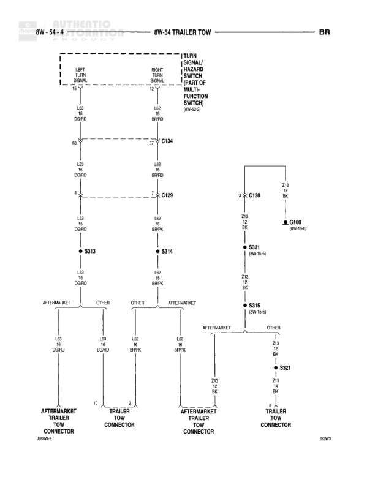

# TRAILER TOW

**Notes:** Diagram shows trailer tow wiring with both aftermarket and OEM trailer connector options. Ground circuit Z13 connects through multiple splices (S321, S315) and terminates at G100.

## Components

| Component | Ref | Connectors | Notes |
|-----------|-----|------------|-------|
| TURN SIGNAL/HAZARD SWITCH WITH MULTI-FUNCTION SWITCH | 8W-52-1 | C134, C109 | Left and right turn signal circuits |
| AFTERMARKET TRAILER TOW CONNECTOR | J8090-4 |  | Aftermarket connection point |
| TRAILER TOW CONNECTOR | None |  | Other variant connector |

## Wires

| From | To | Wire Code | Gauge | Color | Notes |
|------|-----|-----------|-------|-------|-------|
| TURN SIGNAL/HAZARD SWITCH LEFT TURN SIGNAL (Pin 12) | C134 (Pin 63) | L49 | 18 | DG/RD | None |
| TURN SIGNAL/HAZARD SWITCH RIGHT TURN SIGNAL (Pin 13) | C134 (Pin 57) | L40 | 18 | BR/RD | None |
| C134 (Pin 63) | C109 (Pin 4) | L49 | 18 | DG/RD | None |
| C134 (Pin 57) | C109 (Pin 2) | L40 | 18 | BR/RD | None |
| C109 (Pin 4) | S313 | L49 | 18 | DG/RD | None |
| C109 (Pin 2) | S314 | L40 | 18 | BR/RD | None |
| S313 | AFTERMARKET TRAILER TOW CONNECTOR (Pin 10) | L49 | 18 | DG/RD | Aftermarket |
| S313 | TRAILER TOW CONNECTOR | L49 | 18 | DG/RD | Other |
| S314 | TRAILER TOW CONNECTOR (Pin 2) | L40 | 18 | BR/RD | Other |
| S314 | AFTERMARKET TRAILER TOW CONNECTOR | L40 | 18 | BR/RD | Aftermarket |
| C128 (Pin 3) | C128 (Pin 2-3) | Z13 | 18 | BK | None |
| C128 (Pin 2-3) | G100 | Z13 | 18 | BK | 8W-12-6 |
| C128 (Pin 3) | S321 | Z13 | 18 | BK | 8W-15-5 |
| S321 | S315 | Z13 | 18 | BK | 8W-15-5 |
| S315 | AFTERMARKET TRAILER TOW CONNECTOR | Z13 | 18 | BK | Aftermarket |
| S315 | TRAILER TOW CONNECTOR | Z13 | 18 | BK | Other |
| S321 | TRAILER TOW CONNECTOR | Z13 | 18 | BK | None |

## Splices & Grounds

| ID | Type | Location | Wires Connected | Notes |
|----|------|----------|-----------------|-------|
| S313 | splice | Left turn signal circuit | L49 | Splits to aftermarket and other trailer connectors |
| S314 | splice | Right turn signal circuit | L40 | Splits to aftermarket and other trailer connectors |
| S321 | splice | Ground circuit | Z13 | 8W-15-5 |
| S315 | splice | Ground circuit to trailer connectors | Z13 | 8W-15-5 |
| G100 | ground | 8W-12-6 |  | Main ground point |

## Cross-References

- 8W-52-1
- 8W-12-6
- 8W-15-5
