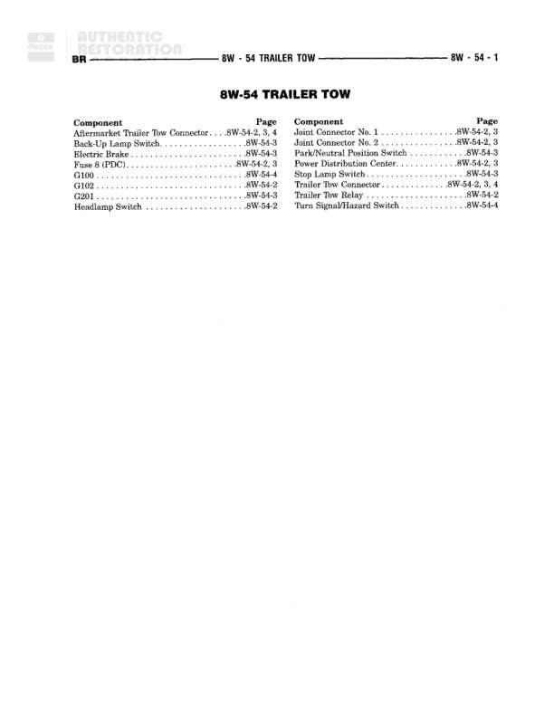

# TRAILER TOW

**Notes:** This is an index page for the Trailer Tow section, listing components and their corresponding diagram page references. Actual wiring details would be found on pages 8W-54-2, 8W-54-3, and 8W-54-4.

## Components

| Component | Ref | Connectors | Notes |
|-----------|-----|------------|-------|
| Aftermarket Trailer Tow Connector | 8W-54-2, 3, 4 |  | None |
| Back-Up Lamp Switch | 8W-54-3 |  | None |
| Electric Brake | 8W-54-3 |  | None |
| Fuse 8 (PDC) | 8W-54-2, 3 |  | None |
| G102 | 8W-54-2 |  | Ground point |
| G201 | 8W-54-3 |  | Ground point |
| Headlamp Switch | 8W-54-2 |  | None |
| Joint Connector No. 1 | 8W-54-2, 3 |  | None |
| Joint Connector No. 2 | 8W-54-2, 3 |  | None |
| Park/Neutral Position Switch | 8W-54-3 |  | None |
| Power Distribution Center | 8W-54-2, 3 |  | None |
| Trailer Tow | 8W-54-2, 3 |  | None |
| Trailer Tow Connector | 8W-54-2, 3, 4 |  | None |
| Trailer Tow Relay | 8W-54-2 |  | None |
| Turn Signal/Hazard Switch | 8W-54-4 |  | None |

## Cross-References

- 8W-54-2
- 8W-54-3
- 8W-54-4
