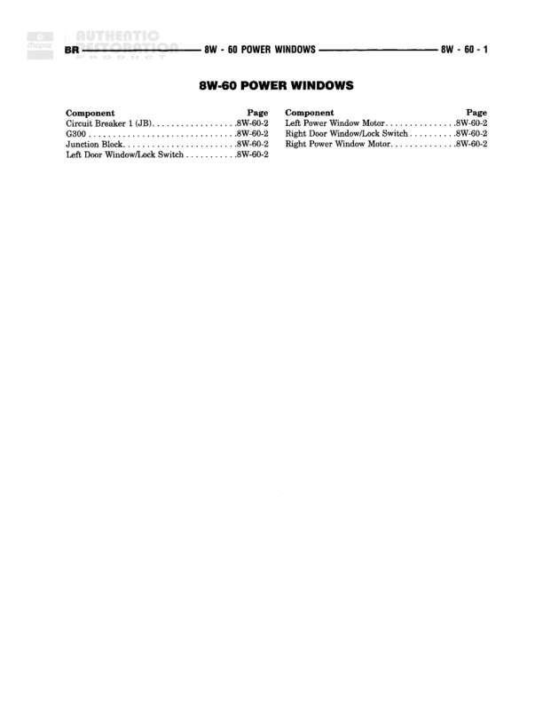

# POWER WINDOWS

**Notes:** This is an index/cover page for the Power Windows section. All detailed wiring information is located on page 8W-60-2.

## Components

| Component | Ref | Connectors | Notes |
|-----------|-----|------------|-------|
| Circuit Breaker (-JB) | 8W-60-2 |  | Junction Block location |
| G300 | 8W-60-2 |  | Ground point |
| Junction Block | 8W-60-2 |  |  |
| Left Power Window Motor | 8W-60-2 |  |  |
| Left Door Window/Lock Switch | 8W-60-2 |  |  |
| Right Door Window/Lock Switch | 8W-60-2 |  |  |
| Right Power Window Motor | 8W-60-2 |  |  |

## Cross-References

- 8W-60-2
