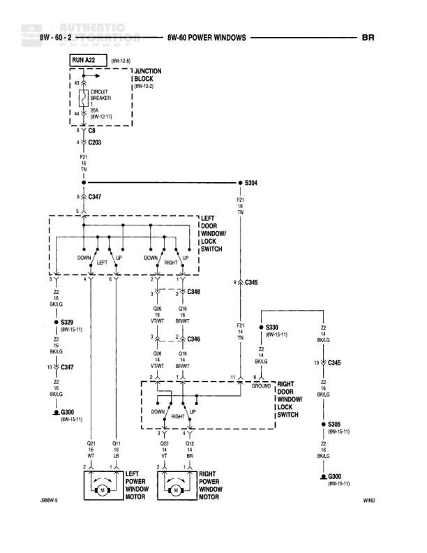

# POWER WINDOWS

**Notes:** BR designation indicates circuit continues to other diagrams. Power windows controlled through master lock switch on driver door with individual controls on passenger door. System includes lockout feature from driver door.

## Components

| Component | Ref | Connectors | Notes |
|-----------|-----|------------|-------|
| RUN ACC | 8W-12-6 |  | Run/Accessory power feed |
| JUNCTION BLOCK | 8W-12-3 |  | Contains circuit breaker 30A |
| LEFT DOOR WINDOW LOCK SWITCH | 8W-60-2 | C347, C348 | Master window lock control |
| RIGHT DOOR WINDOW LOCK SWITCH | 8W-60-2 | C345 | Passenger side window lock |
| LEFT POWER WINDOW MOTOR | 8W-60-2 |  | Driver side window motor |
| RIGHT POWER WINDOW MOTOR | 8W-60-2 |  | Passenger side window motor |

## Wires

| From | To | Wire Code | Gauge | Color | Notes |
|------|-----|-----------|-------|-------|-------|
| RUN ACC | JUNCTION BLOCK | F21 | 12 | TN |  |
| JUNCTION BLOCK C/B 30A | C203 | F21 | 12 | TN | Circuit breaker 30A |
| C203 | S304 | F21 | 12 | TN |  |
| S304 | C347 pin 5 | F21 | 12 | TN |  |
| S304 | S330 | F21 | 12 | TN |  |
| C347 pin 2 | LEFT DOOR WINDOW LOCK SWITCH DOWN LEFT | Q21 | 16 | WT |  |
| LEFT DOOR WINDOW LOCK SWITCH LEFT UP | LEFT POWER WINDOW MOTOR Q21 | Q21 | 16 | LB |  |
| C347 pin 1 | LEFT DOOR WINDOW LOCK SWITCH DOWN LEFT | Q22 | 16 | VT |  |
| LEFT DOOR WINDOW LOCK SWITCH LEFT UP | LEFT POWER WINDOW MOTOR Q22 | Q22 | 16 | BR |  |
| C347 pin 4 | S329 | Z2 | 16 | BK/LG |  |
| S329 | C347 pin 7 | Z2 | 16 | BK/LG |  |
| C347 pin 7 | G300 | Z2 | 16 | BK/LG |  |
| C348 pin 1 | LEFT DOOR WINDOW LOCK SWITCH DOWN RIGHT | Q26 | 18 | VT/WT |  |
| C348 pin 3 | LEFT DOOR WINDOW LOCK SWITCH DOWN RIGHT | Q16 | 18 | VT/WT |  |
| LEFT DOOR WINDOW LOCK SWITCH RIGHT UP | C346 pin 2 | Q26 | 18 | BK/WT |  |
| LEFT DOOR WINDOW LOCK SWITCH RIGHT UP | C346 pin 3 | Q16 | 18 | BK/WT |  |
| C346 pin 2 | RIGHT DOOR WINDOW LOCK SWITCH DOWN | Q26 | 18 | VT/WT |  |
| C346 pin 3 | RIGHT DOOR WINDOW LOCK SWITCH DOWN | Q16 | 18 | BK/WT |  |
| RIGHT DOOR WINDOW LOCK SWITCH UP | RIGHT POWER WINDOW MOTOR Q23 | Q23 | 18 | VT |  |
| RIGHT DOOR WINDOW LOCK SWITCH UP | RIGHT POWER WINDOW MOTOR Q12 | Q12 | 18 | BR |  |
| S330 | C345 pin 10 | F21 | 14 | BK/LB |  |
| C345 pin 10 | RIGHT DOOR WINDOW LOCK SWITCH | F21 | 14 | BK/LB |  |
| C345 pin 12 | S305 | Z2 | 14 | BK/LG |  |
| S305 | G300 | Z2 | 14 | BK/LG |  |

## Splices & Grounds

| ID | Type | Location | Wires Connected | Notes |
|----|------|----------|-----------------|-------|
| S304 | splice | Between junction block and door switches | F21 | Splits power feed to left and right door circuits |
| S329 | splice | Left door area | Z2 | Ground connection for left door switches |
| S330 | splice | Between left and right door feeds | F21 | Continuation to right door |
| S305 | splice | Right door area | Z2 | Ground connection for right door |
| G300 | ground | 8W-15-11 |  | Common ground point for window circuits |

## Cross-References

- 8W-12-6
- 8W-12-3
- 8W-15-11
