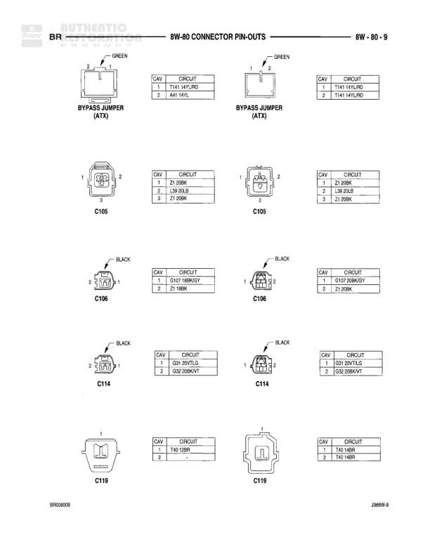

# 8W-60 CONNECTOR PIN-OUTS

**Notes:** This diagram shows connector pin-out details for fuel injectors. Document numbers BR60987 and JA8609-8 appear at bottom.

## Components

| Component | Ref | Connectors | Notes |
|-----------|-----|------------|-------|
| FUEL INJECTOR NO. 1 | (3-M,5-JLS,6L) | 2-pin connector | Cavity 1: K11 18WT/OR - INJECTOR NO. 1 DRIVER, Cavity 2: A18 12GY/OR - AUTO SHUTDOWN RELAY OUTPUT |
| FUEL INJECTOR NO. 1 | (6AL) | 2-pin connector | Cavity 1: K11 18WT/OR - INJECTOR NO.1 DRIVER, Cavity 2: A18 12GY/OR - AUTO SHUTDOWN RELAY OUTPUT |
| FUEL INJECTOR NO. 2 | (3-M,5-JLS,6L) | 2-pin connector | Cavity 1: K12 18TN - INJECTOR NO. 2 DRIVER, Cavity 2: A18 12GY/OR - AUTO SHUTDOWN RELAY OUTPUT |
| FUEL INJECTOR NO. 2 | (6AL) | 2-pin connector | Cavity 1: K12 18TN - INJECTOR NO. 2 DRIVER, Cavity 2: A18 12GY/OR - AUTO SHUTDOWN RELAY OUTPUT |
| FUEL INJECTOR NO. 3 | (3-M,5-JLS,6L) | 2-pin connector | Cavity 1: K13 18OR/WT - INJECTOR NO. 3 DRIVER, Cavity 2: A18 12GY/OR - AUTO SHUTDOWN RELAY OUTPUT |
| FUEL INJECTOR NO. 3 | (6AL) | 2-pin connector | Cavity 1: K13 18OR/WT - AUTO SHUTDOWN RELAY OUTPUT, Cavity 2: A18 12GY/OR - INJECTOR NO. 3 DRIVER |

## Wires

| From | To | Wire Code | Gauge | Color | Notes |
|------|-----|-----------|-------|-------|-------|
| FUEL INJECTOR NO. 1 (3-M,5-JLS,6L) Cavity 1 | None | K11 | 18 | WT/OR | INJECTOR NO. 1 DRIVER |
| FUEL INJECTOR NO. 1 (3-M,5-JLS,6L) Cavity 2 | None | A18 | 12 | GY/OR | AUTO SHUTDOWN RELAY OUTPUT |
| FUEL INJECTOR NO. 1 (6AL) Cavity 1 | None | K11 | 18 | WT/OR | INJECTOR NO.1 DRIVER |
| FUEL INJECTOR NO. 1 (6AL) Cavity 2 | None | A18 | 12 | GY/OR | AUTO SHUTDOWN RELAY OUTPUT |
| FUEL INJECTOR NO. 2 (3-M,5-JLS,6L) Cavity 1 | None | K12 | 18 | TN | INJECTOR NO. 2 DRIVER |
| FUEL INJECTOR NO. 2 (3-M,5-JLS,6L) Cavity 2 | None | A18 | 12 | GY/OR | AUTO SHUTDOWN RELAY OUTPUT |
| FUEL INJECTOR NO. 2 (6AL) Cavity 1 | None | K12 | 18 | TN | INJECTOR NO. 2 DRIVER |
| FUEL INJECTOR NO. 2 (6AL) Cavity 2 | None | A18 | 12 | GY/OR | AUTO SHUTDOWN RELAY OUTPUT |
| FUEL INJECTOR NO. 3 (3-M,5-JLS,6L) Cavity 1 | None | K13 | 18 | OR/WT | INJECTOR NO. 3 DRIVER |
| FUEL INJECTOR NO. 3 (3-M,5-JLS,6L) Cavity 2 | None | A18 | 12 | GY/OR | AUTO SHUTDOWN RELAY OUTPUT |
| FUEL INJECTOR NO. 3 (6AL) Cavity 1 | None | K13 | 18 | OR/WT | AUTO SHUTDOWN RELAY OUTPUT |
| FUEL INJECTOR NO. 3 (6AL) Cavity 2 | None | A18 | 12 | GY/OR | INJECTOR NO. 3 DRIVER |
