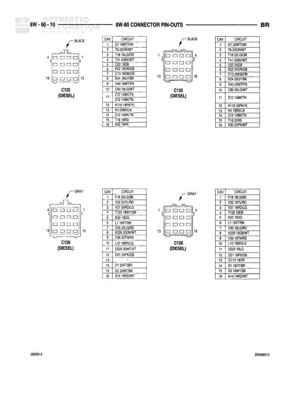

# 8W-60 CONNECTOR PIN-OUTS

**Notes:** Connector pin-out reference page showing pin assignments for heated mirror switch, high note horn, and horizontal seat motor. Document reference BR090303 and 20BBW-9.

## Components

| Component | Ref | Connectors | Notes |
|-----------|-----|------------|-------|
| HEATED MIRROR SWITCH | 8W-60-33 | C16D | 3-pin connector |
| HIGH NOTE HORN | 8W-60-33 | 2-pin connector | Horn relay output |
| HORIZONTAL SEAT MOTOR | 8W-60-33 | 2-pin connector | Left power seat controls |

## Wires

| From | To | Wire Code | Gauge | Color | Notes |
|------|-----|-----------|-------|-------|-------|
| HEATED MIRROR SWITCH C16D Pin 1 | FUSED IGN RUN | F35 | 20 | DB | Fused ignition run power |
| HEATED MIRROR SWITCH C16D Pin 2 | GROUND | Z2 | 20 | BK/OR | Ground connection |
| HEATED MIRROR SWITCH C16D Pin 3 | HEATED DEFOGGER LAMP DRIVER | C19 | 20 | LB/YL | Lamp driver signal |
| HIGH NOTE HORN Pin 1 | HORN RELAY OUTPUT | K2 | 16 | RD/RD | Horn relay output signal |
| HIGH NOTE HORN Pin 2 | GROUND | Z1 | 18 | BK | Ground connection |
| HORIZONTAL SEAT MOTOR Pin 1 | LEFT POWER SEAT HORIZONTAL REARWARD | P17 | 14 | RD/RD | Rearward movement control |
| HORIZONTAL SEAT MOTOR Pin 2 | LEFT POWER SEAT HORIZONTAL FORWARD | P14 | 14 | YL/LB | Forward movement control |
