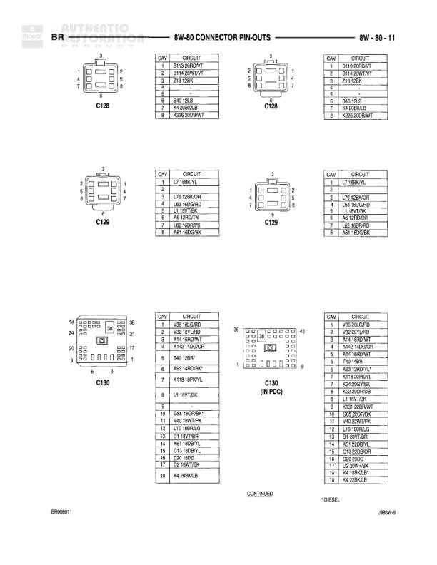

# BR - 8W-60 CONNECTOR PIN-OUTS

**Notes:** This page shows connector pin-outs for various left door and fog lamp components. Document reference: BR000084, JAMB-0.

## Components

| Component | Ref | Connectors | Notes |
|-----------|-----|------------|-------|
| LEFT DOOR JAMB SWITCH (CTM) | 8W-60-44 | 2-pin connector | Controlled Through Module |
| LEFT DOOR JAMB SWITCH (IEM) | 8W-60-44 | 3-pin connector | Integrated Electronics Module |
| LEFT DOOR LOCK MOTOR | 8W-60-44 | 2-pin connector | None |
| LEFT DOOR WINDOW/LOCK SWITCH | 8W-60-44 | 10-pin connector | None |
| LEFT FOG LAMP | 8W-60-44 | 2-pin connector | None |

## Wires

| From | To | Wire Code | Gauge | Color | Notes |
|------|-----|-----------|-------|-------|-------|
| LEFT DOOR JAMB SWITCH (CTM) | Pin 1 | Z2 | 18 | BK | GROUND |
| LEFT DOOR JAMB SWITCH (CTM) | Pin 2 | M2 | 18 | BK | LEFT DOOR AJAR SWITCH SENSE |
| LEFT DOOR JAMB SWITCH (IEM) | Pin 1 | Z2 | 18 | BK | GROUND |
| LEFT DOOR JAMB SWITCH (IEM) | Pin 2 | M2 | 18 | BK | LEFT DOOR AJAR SWITCH SENSE |
| LEFT DOOR JAMB SWITCH (IEM) | Pin 3 | M2 | 18 | PK | DOOR LATCH SWITCH SENSE |
| LEFT DOOR LOCK MOTOR | Pin 1 | P33 | 20 | PK | DOOR UNLOCK DRIVER |
| LEFT DOOR LOCK MOTOR | Pin 2 | P33 | 20 | OR | DOOR LOCK DRIVER |
| LEFT DOOR WINDOW/LOCK SWITCH | Pin 1 | Q28 | 18 | WT | WINDOW SWITCH RIGHT FLOAT UP |
| LEFT DOOR WINDOW/LOCK SWITCH | Pin 2 | Q28 | 18 | VT | WINDOW SWITCH RIGHT FLOAT DOWN |
| LEFT DOOR WINDOW/LOCK SWITCH | Pin 3 | Z2 | 18 | BK | GROUND |
| LEFT DOOR WINDOW/LOCK SWITCH | Pin 4 | Q21 | 16 | WT | LEFT FRONT WINDOW DRIVER DOWN |
| LEFT DOOR WINDOW/LOCK SWITCH | Pin 5 | Q21 | 16 | VT | LEFT FRONT WINDOW DRIVER UP |
| LEFT DOOR WINDOW/LOCK SWITCH | Pin 6 | Q11 | 16 | LB | LEFT FRONT WINDOW DRIVER UP |
| LEFT DOOR WINDOW/LOCK SWITCH | Pin 7 | P36 | 20 | DG | DOOR UNLOCK SWITCH SENSE |
| LEFT DOOR WINDOW/LOCK SWITCH | Pin 8 | P35 | 20 | WT | DOOR LOCK SWITCH SENSE |
| LEFT DOOR WINDOW/LOCK SWITCH | Pin 9 | Z2 | 20 | BK | GROUND |
| LEFT DOOR WINDOW/LOCK SWITCH | Pin 10 | Z2 | 20 | BK | GROUND |
| LEFT FOG LAMP | Pin 1 | Z1 | 20 | BK | GROUND |
| LEFT FOG LAMP | Pin 2 | L32 | 20 | LB | FRONT FOG LAMP SWITCH OUTPUT |
