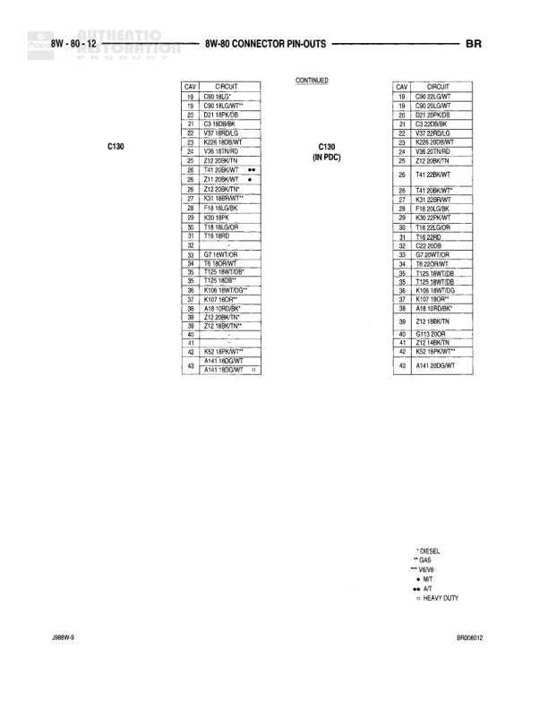

# Connector Pin-Outs

**Notes:** Heavy Duty designation indicates this is for heavy duty vehicles with 3.9L, 5.2L, or 5.9L engines. Document shows connector pin-out tables for Power Outlet (3-pin), Power Seat Switch (14-pin), and Powertrain Control Module C1 connector (38-pin).

## Components

| Component | Ref | Connectors | Notes |
|-----------|-----|------------|-------|
| Power Outlet | 8W-60-52 | 3-pin connector | Power outlet connector |
| Power Seat Switch | 8W-60-52 | 14-pin connector | Power seat control switch |
| Powertrain Control Module - C1 | 8W-60-52 | 38-pin connector (3.9L/5.2L/5.9L) | Heavy Duty - PCM Connector C1 |

## Wires

| From | To | Wire Code | Gauge | Color | Notes |
|------|-----|-----------|-------|-------|-------|
| Power Outlet Pin 1 | Power outlet feed | A12 | 18 | RD/YL | Power outlet feed |
| Power Outlet Pin 3 | Ground | Z3 | 18 | BK/OR | Ground |
| Power Seat Switch Pin A | Fused B(+) | F37 | 14 | RD/LB | Fused B(+) |
| Power Seat Switch Pin B | Ground | Z3 | 14 | BK/OR | Ground |
| Power Seat Switch Pin E | Power seat rear up | P11 | 14 | WT/VT | Power seat rear up |
| Power Seat Switch Pin J | Power seat rear down | P13 | 14 | WT/YT | Power seat rear down |
| Power Seat Switch Pin K | Power seat horizontal, backward | P17 | 14 | RD/RD | Power seat horizontal, backward |
| Power Seat Switch Pin L | Power seat horizontal, forward | P15 | 14 | BR/YL | Power seat horizontal, forward |
| Power Seat Switch Pin M | Power seat front up | P18 | 14 | VT/LG | Power seat front up |
| Power Seat Switch Pin N | Power seat front down | P21 | 14 | RD/LB | Power seat front down |
| PCM C1 Pin 1 | Fused ignition (B+ RUN) | F18 | 18 | LG/BK | Fused ignition (B+ RUN) |
| PCM C1 Pin 4 | Sensor ground | K4 | 18 | BK/LB | Sensor ground |
| PCM C1 Pin 5 | Park/neutral position switch sense | T41 | 18 | DB/WT | Park/neutral position switch sense |
| PCM C1 Pin 6 | Bbl coil no. 1 driver | K15 | 18 | YL/GY | Bbl coil no. 1 driver |
| PCM C1 Pin 7 | Spare | None | None | None | Spare pin |
| PCM C1 Pin 8 | Crank position sensor signal | K24 | 18 | GY/BK | Crank position sensor signal |
| PCM C1 Pin 10 | Idle air control, no. 2 driver | K26 | 18 | WT/OR | Idle air control, no. 2 driver |
| PCM C1 Pin 11 | Idle air control, no. 3 driver | K45 | 18 | BR/WT | Idle air control, no. 3 driver |
| PCM C1 Pin 13 | PTO switch sense | G115 | None | GR | PTO switch sense |
| PCM C1 Pin 15 | Intake air temperature signal | K21 | 18 | BK/RD | Intake air temperature signal |
| PCM C1 Pin 16 | Engine coolant temperature sensor signal | K2 | 18 | WT/BR | Engine coolant temperature sensor signal |
| PCM C1 Pin 17 | 5 volt supply | K6 | 18 | WT/WT | 5 volt supply |
| PCM C1 Pin 18 | Throttle position sensor signal | K3 | 18 | OR/DB | Throttle position sensor signal |
| PCM C1 Pin 19 | Idle air control, no. 1 driver | K39 | 18 | GY/RD | Idle air control, no. 1 driver |
| PCM C1 Pin 20 | Idle air control, no. 4 driver | K29 | 18 | WT/BK | Idle air control, no. 4 driver |
| PCM C1 Pin 22 | Fused B(+) | A14 | 18 | GY/VT | Fused B(+) |
| PCM C1 Pin 23 | Throttle position sensor signal | K22 | 18 | DB/OR | Throttle position sensor signal |
| PCM C1 Pin 24 | Downstream heated oxygen sensor signal | K41 | 18 | BK/BK | Downstream heated oxygen sensor signal |
| PCM C1 Pin 25 | Downstream heated oxygen sensor signal | K38 | 18 | BK/BK | Downstream heated oxygen sensor signal |
| PCM C1 Pin 26 | Upstream heated oxygen sensor signal | K241 | 18 | BR/RD | Upstream heated oxygen sensor signal |
| PCM C1 Pin 27 | Map sensor signal | K1 | 18 | RD/RD | Map sensor signal |
| PCM C1 Pin 31 | Ground | Z12 | 14 | BK/TN | Ground |
| PCM C1 Pin 32 | Ground | Z12 | 14 | BK/TN | Ground |
