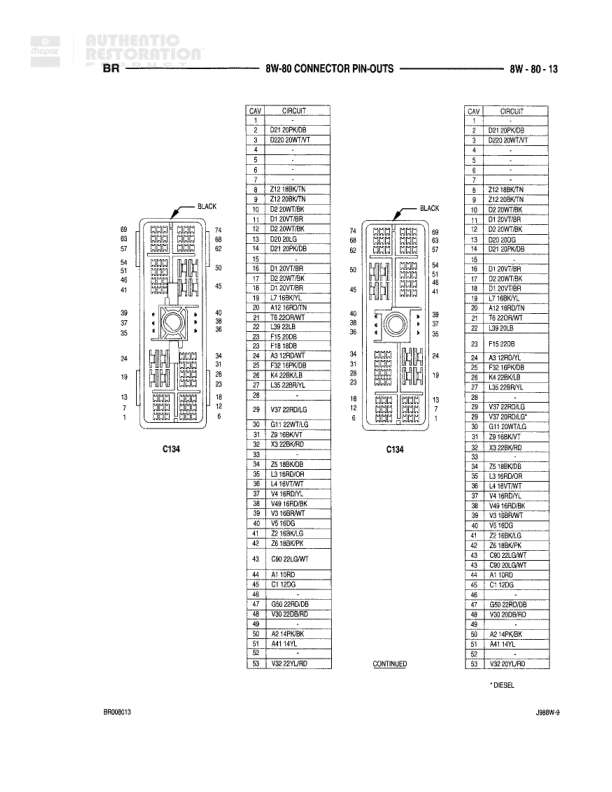

# CONNECTOR PIN-OUTS

**Notes:** This is a connector pin-out reference diagram showing various right-side door and lighting connectors. Document BR690803, JOBRN-9.

## Components

| Component | Ref | Connectors | Notes |
|-----------|-----|------------|-------|
| RIGHT DOOR LOCK MOTOR | 8W-60-63 | C1 (2-pin) | 2-pin connector |
| RIGHT DOOR WINDOW/LOCK SWITCH | 8W-60-63 | C2 (11-pin) | 11-pin connector |
| RIGHT FOG LAMP | 8W-60-63 | C3 (2-pin) | 2-pin connector |
| RIGHT FRONT DOOR SPEAKER (PREMIUM) | 8W-60-63 | C4 (6-pin) | 6-pin connector, Premium audio system |
| RIGHT FRONT DOOR SPEAKER (STANDARD) | 8W-60-63 | C5 (2-pin) | 2-pin connector, Standard audio system |
| RIGHT FRONT FENDER LAMP (DUAL REAR WHEELS) | 8W-60-63 | C6 (2-pin) | 2-pin connector, Dual rear wheels only |

## Wires

| From | To | Wire Code | Gauge | Color | Notes |
|------|-----|-----------|-------|-------|-------|
| RIGHT DOOR LOCK MOTOR | Pin 1 | P3 | 20 | PK/BK | DOOR UNLOCK DRIVER |
| RIGHT DOOR LOCK MOTOR | Pin 2 | P3 | 20 | PK/BK | DOOR LOCK DRIVER |
| RIGHT DOOR WINDOW/LOCK SWITCH | Pin 1 | Q18 | 14 | BR/WT | MASTER WINDOW SWITCH-RIGHT FRONT UP |
| RIGHT DOOR WINDOW/LOCK SWITCH | Pin 2 | Q18 | 17 | WT | MASTER WINDOW SWITCH-RIGHT FRONT DOWN |
| RIGHT DOOR WINDOW/LOCK SWITCH | Pin 3 | Q18 | 14 | BR/WT | MASTER WINDOW SWITCH-RIGHT FRONT UP |
| RIGHT DOOR WINDOW/LOCK SWITCH | Pin 4 | Q12 | 14 | BR | RIGHT FRONT WINDOW DRIVER UP |
| RIGHT DOOR WINDOW/LOCK SWITCH | Pin 5 | F28 | 20 | GY/RD | FUSED B(+) |
| RIGHT DOOR WINDOW/LOCK SWITCH | Pin 6 | P3 | 20 | PK/BK | MASTER SWITCH-REMOTE LOCK |
| RIGHT DOOR WINDOW/LOCK SWITCH | Pin 7 | P6 | 20 | OR/DG | POWER DOOR LOCK MOTOR-RIGHT LOCK |
| RIGHT DOOR WINDOW/LOCK SWITCH | Pin 8 | Z1 | 14 | BK/LG |  |
| RIGHT DOOR WINDOW/LOCK SWITCH | Pin 9 | P6 | 20 | OR/DG | POWER DOOR LOCK MOTOR-RIGHT UNLOCK |
| RIGHT DOOR WINDOW/LOCK SWITCH | Pin 10 | P4 | 20 | WT | POWER LOCK SWITCH OUTPUT-UNLOCK |
| RIGHT DOOR WINDOW/LOCK SWITCH | Pin 11 | P5 | 14 | TN | FUSED IGN. RUN |
| RIGHT FOG LAMP | Pin 1 | F1 | 20 | BR/OR | GROUND |
| RIGHT FOG LAMP | Pin 2 | L39 | 20 | BK/LB | FRONT FOG LAMP SWITCH OUTPUT |
| RIGHT FRONT DOOR SPEAKER (PREMIUM) | Pin 1 | X54 | 18 | WT | RIGHT DOOR SPEAKER (+) |
| RIGHT FRONT DOOR SPEAKER (PREMIUM) | Pin 2 | Z9 | 18 | BK/WT | GROUND |
| RIGHT FRONT DOOR SPEAKER (PREMIUM) | Pin 3 | X43 | 18 | LB/YL | RIGHT FRONT DOOR SPEAKER (-) |
| RIGHT FRONT DOOR SPEAKER (PREMIUM) | Pin 4 | X48 | 18 | LB/RD | RIGHT DOOR SPEAKER (-) |
| RIGHT FRONT DOOR SPEAKER (PREMIUM) | Pin 5 | X13 | 18 | GY/RD | PREMIUM SPEAKER AMPLIFIER |
| RIGHT FRONT DOOR SPEAKER (PREMIUM) | Pin 6 | X60 | 20 | RD/BK | AMPLIFIER RIGHT DOOR SPEAKER (+) |
| RIGHT FRONT DOOR SPEAKER (STANDARD) | Pin A | X66 | 18 | LB/RD | RIGHT DOOR SPEAKER (-) |
| RIGHT FRONT DOOR SPEAKER (STANDARD) | Pin B | X54 | 18 | WT | RIGHT DOOR SPEAKER (+) |
| RIGHT FRONT FENDER LAMP (DUAL REAR WHEELS) | Pin 1 | Z13 | 18 | BK/WT | GROUND |
| RIGHT FRONT FENDER LAMP (DUAL REAR WHEELS) | Pin 2 | L7 | 18 | BR/YL | PARK LAMP SWITCH OUTPUT |
