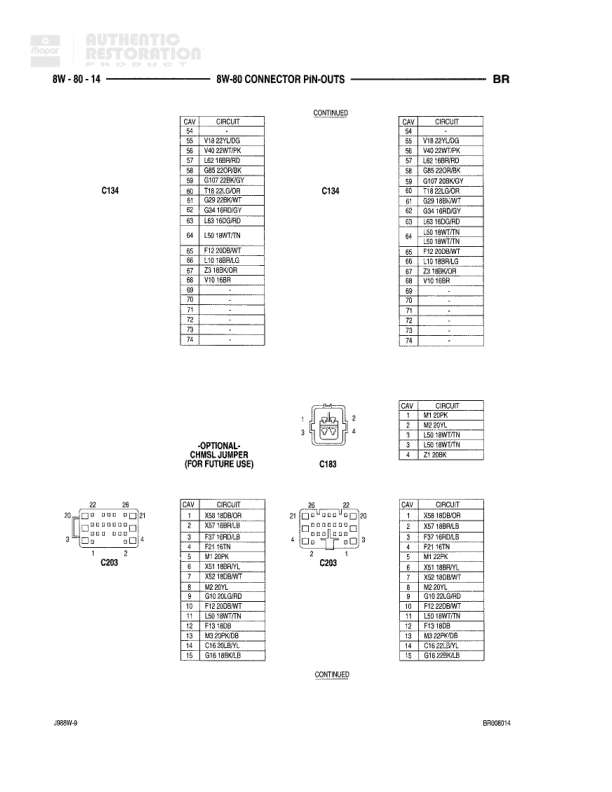

# AUTOMATIC - 8W-60 CONNECTOR PIN-OUTS

**Notes:** This page shows connector pin-out information for various right side components. Document reference: BR80400S, Page J08AW-9

## Components

| Component | Ref | Connectors | Notes |
|-----------|-----|------------|-------|
| RIGHT POWER MIRROR MOTORS | 8W-60-65 | 5-pin connector | Connector pins numbered 1-5 |
| RIGHT POWER WINDOW MOTOR | 8W-60-65 | 2-pin connector | Connector pins numbered 1-2 |
| RIGHT REAR FENDER LAMP (DUAL REAR WHEELS) | 8W-60-65 | 2-pin connector | Connector pins numbered 1-2 |
| RIGHT REAR SPEAKER (PREMIUM) | 8W-60-65 | 2-pin connector | Connector pins numbered 1-2 |
| RIGHT REAR SPEAKER (STANDARD) | 8W-60-65 | 2-pin connector | Connector pins labeled A-B |

## Wires

| From | To | Wire Code | Gauge | Color | Notes |
|------|-----|-----------|-------|-------|-------|
| RIGHT POWER MIRROR MOTORS | Pin 1 | P73 | None | PK/RD | POWER MIRROR-LEFT CONTROL |
| RIGHT POWER MIRROR MOTORS | Pin 2 | P70 | None | RD/WT | POWER MIRROR-RIGHT/DOWN CONTROL |
| RIGHT POWER MIRROR MOTORS | Pin 3 | P71 | None | BR/BK | POWER MIRROR-LEFT/UP CONTROL |
| RIGHT POWER MIRROR MOTORS | Pin 4 | C16 | None | DB/YL | REAR DEFOGGER LAMP DRIVER |
| RIGHT POWER MIRROR MOTORS | Pin 5 | Z2 | None | BK/LG | GROUND |
| RIGHT POWER WINDOW MOTOR | Pin 1 | Q42 | None | LB/BK | POWER WINDOW UP CONTROL |
| RIGHT POWER WINDOW MOTOR | Pin 2 | Q42 | None | WT/YL | POWER WINDOW DOWN CONTROL |
| RIGHT REAR FENDER LAMP (DUAL REAR WHEELS) | Pin 1 | Z3 | None | BK/WT | GROUND |
| RIGHT REAR FENDER LAMP (DUAL REAR WHEELS) | Pin 2 | L7 | None | RD/OR | PARK LAMP SWITCH OUTPUT |
| RIGHT REAR SPEAKER (PREMIUM) | Pin 1 | X39 | None | TN/DB | RIGHT REAR SPEAKER (-) |
| RIGHT REAR SPEAKER (PREMIUM) | Pin 2 | X39 | None | VT/GY | RIGHT REAR SPEAKER (+) |
| RIGHT REAR SPEAKER (STANDARD) | Pin A | X38 | None | LB/OR | RIGHT REAR SPEAKER (-) |
| RIGHT REAR SPEAKER (STANDARD) | Pin B | X38 | None | TN/WT | RIGHT REAR SPEAKER (+) |
