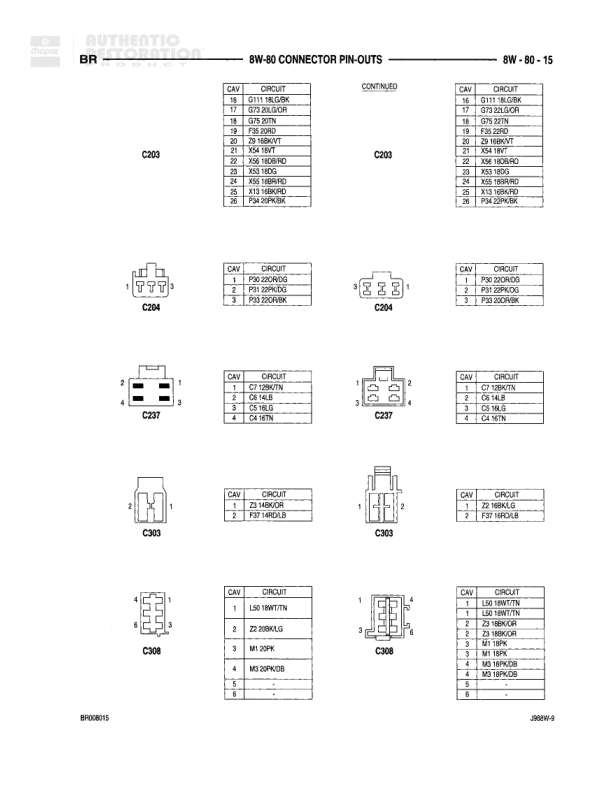

# Connector Pin-Outs

**Notes:** This diagram shows connector pin-outs for various components in the seatbelt control system, stop lamp switch, and throttle position sensors (both diesel and gas variants). Document reference BR08067 and J4BW-9.

## Components

| Component | Ref | Connectors | Notes |
|-----------|-----|------------|-------|
| Seatbelt Control Module | 8W-60-67 | 13-pin connector | Main seatbelt system control module |
| Seatbelt Switch | 8W-60-67 | 2-pin connector | Detects seatbelt engagement |
| Stop Lamp Switch | 8W-60-67 | 6-pin connector | Brake switch with speed control integration |
| Throttle Position Sensor (Diesel) | 8W-60-67 | 3-pin connector | Diesel engine throttle position sensor |
| Throttle Position Sensor (Gas) | 8W-60-67 | 3-pin connector | Gas engine throttle position sensor |

## Wires

| From | To | Wire Code | Gauge | Color | Notes |
|------|-----|-----------|-------|-------|-------|
| Seatbelt Control Module Pin 1 | None | None | None | None | Blank/Not Used |
| Seatbelt Control Module Pin 2 | None | D4 | 18 | TN/RD | Right Door Ajar Switch Sense |
| Seatbelt Control Module Pin 3 | None | D4 | 18 | TN/RD | Right Door Ajar Switch Sense |
| Seatbelt Control Module Pin 4 | None | F13 | 14 | DB | Fused Ignition/Run/Accy |
| Seatbelt Control Module Pin 5 | None | M7 | 18 | PK | Fused Ignition |
| Seatbelt Control Module Pin 6 | None | None | None | None | Blank/Not Used |
| Seatbelt Control Module Pin 7 | None | R7 | 18 | BR/WT | Left Seatbelt Solenoid Signal from SBCM |
| Seatbelt Control Module Pin 8 | None | R8 | 18 | DG/RD | Right Seatbelt Solenoid Signal from SBCM |
| Seatbelt Control Module Pin 9 | None | None | None | None | Blank/Not Used |
| Seatbelt Control Module Pin 10 | None | None | None | None | Blank/Not Used |
| Seatbelt Control Module Pin 11 | None | G111 | 18 | GY/BK | Seat Fault Indicator |
| Seatbelt Control Module Pin 12 | None | None | None | None | Blank/Not Used |
| Seatbelt Control Module Pin 13 | None | Z18 | 18 | BK/PK | Ground |
| Seatbelt Switch Pin 1 | None | G10 | 20 | GY/LG | Seatbelt Switch Sense |
| Seatbelt Switch Pin 2 | None | F12 | 14 | BR/WT | Fused IGN (21-Run) |
| Stop Lamp Switch Pin 1 | None | V02 | 22 | VT/PK | Brake Switch Sense |
| Stop Lamp Switch Pin 2 | None | None | None | None | Ground |
| Stop Lamp Switch Pin 3 | None | V09 | 20 | LG/RD | Speed Control Feed |
| Stop Lamp Switch Pin 4 | None | V10 | 20 | DB/RD | Speed Control On/Off Switch Output |
| Stop Lamp Switch Pin 5 | None | L50 | 18 | BR/TN | Stop Lamp Switch Output |
| Stop Lamp Switch Pin 6 | None | F38 | 18 | RD/OR | Fused (B+) |
| Throttle Position Sensor (Diesel) Pin 1 | None | K4 | 20 | OR/BK | Sensor Ground |
| Throttle Position Sensor (Diesel) Pin 2 | None | K23 | 18 | OR/LG | Throttle Position Sensor Signal |
| Throttle Position Sensor (Diesel) Pin 3 | None | K6 | 20 | RD/WT | 5 Volt Supply |
| Throttle Position Sensor (Gas) Pin 1 | None | K3 | 20 | VT/WT | 5 Volt Output |
| Throttle Position Sensor (Gas) Pin 2 | None | K22 | 18 | OR/DB | Throttle Position Sensor Signal |
| Throttle Position Sensor (Gas) Pin 3 | None | K4 | 18 | BK/LB | 5 Volt Supply |
