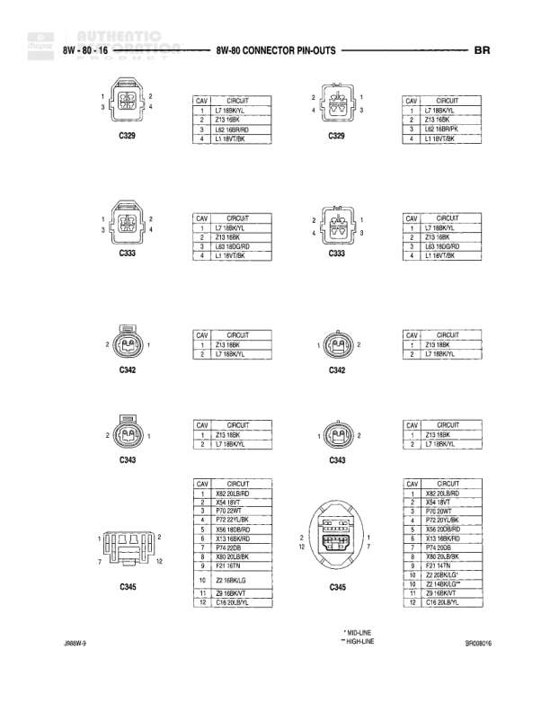

# Connector Pin-Outs

**Notes:** This diagram shows connector pin-out configurations for various components including trailer tow connector, transmission sensors and solenoid assembly, and underhood lamp. BR designation appears in top right corner.

## Components

| Component | Ref | Connectors | Notes |
|-----------|-----|------------|-------|
| Trailer Tow Connector | 8W-60-68 | 9-pin connector | 9-pin trailer tow connector |
| Transmission Output Shaft Speed Sensor | 8W-60-68 | 2-pin connector | 2-pin connector |
| Transmission Solenoid Assembly | 8W-60-68 | 8-pin connector | 8-pin connector |
| Underhood Lamp | 8W-60-68 | 2-pin connector | 2-pin connector |

## Wires

| From | To | Wire Code | Gauge | Color | Notes |
|------|-----|-----------|-------|-------|-------|
| Trailer Tow Connector Pin 1 | Right Turn Signal | L12 | None | DB/PK | None |
| Trailer Tow Connector Pin 2 | Backup Lamp Feed | L1 | None | BR/YL | None |
| Trailer Tow Connector Pin 3 | Fused B(+) | A6 | None | DB/YL | None |
| Trailer Tow Connector Pin 4 | Trailer Tow Relay Output | F93 | None | YL/BK | None |
| Trailer Tow Connector Pin 5 | Not Connected | None | None | None | Not connected |
| Trailer Tow Connector Pin 6 | Trailer Tow Brake B(+) | B50 | None | YL/B | None |
| Trailer Tow Connector Pin 7 | Ground | Z13 | None | BK/ | None |
| Trailer Tow Connector Pin 8 | Not Connected | None | None | None | Not connected |
| Trailer Tow Connector Pin 9 | Left Turn Signal | L63 | None | DG/RD | None |
| Transmission Output Shaft Speed Sensor Pin 1 | Output Shaft Speed Sensor Signal | T14 | None | YL/BK | None |
| Transmission Output Shaft Speed Sensor Pin 2 | Output Shaft Speed Sensor Ground | T13 | None | DG/BK | None |
| Transmission Solenoid Assembly Pin 1 | Trans Control Relay Output | F18 | None | RD/ | None |
| Transmission Solenoid Assembly Pin 2 | 12 Supply | K7 | None | BK/R | None |
| Transmission Solenoid Assembly Pin 3 | Sensor Ground | K4 | None | BR/LG | None |
| Transmission Solenoid Assembly Pin 4 | Trans Temperature Signal | K23 | None | OR/DG | None |
| Transmission Solenoid Assembly Pin 5 | Variable Force Solenoid Control | K88 | None | WT/VT | None |
| Transmission Solenoid Assembly Pin 6 | Overdrive Solenoid Control | T60 | None | VT/BR | None |
| Transmission Solenoid Assembly Pin 7 | Torque Converter Clutch Solenoid Control | K84 | None | RD/BK | None |
| Transmission Solenoid Assembly Pin 8 | Trans Temperature Sensor Signal | T54 | None | TN/T | None |
| Underhood Lamp Pin 1 | Ground | Z1 | None | BK/ | None |
| Underhood Lamp Pin 2 | Fused B(+) | M1 | None | GY/ | None |
