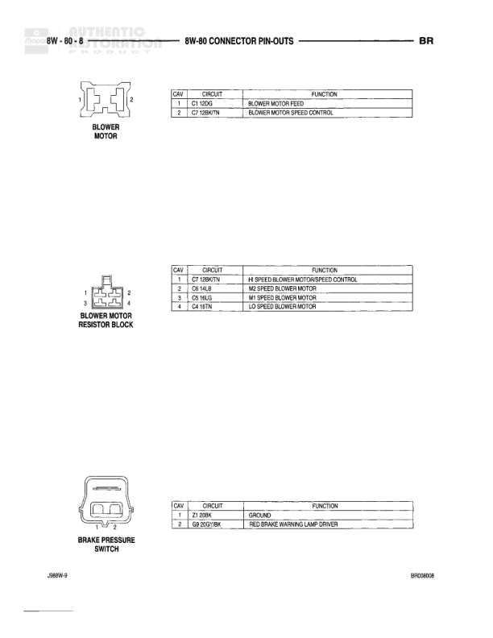

# BR - Connector Pin-Outs

**Notes:** This page shows connector pin-out details for Blower Motor, Blower Motor Resistor Block, and Brake Pressure Switch. Wire colors use standard abbreviations: BK/O (Black/Orange), LB/OR/TN (Light Blue/Orange/Tan), YL/LB (Yellow/Light Blue), YL/LG (Yellow/Light Green), YL/TN (Yellow/Tan), BK/W (Black/White), GY/BK (Gray/Black)

## Components

| Component | Ref | Connectors | Notes |
|-----------|-----|------------|-------|
| Blower Motor | 8W-60-8 | C1 (2-pin) | 2-cavity connector |
| Blower Motor Resistor Block | 8W-60-8 | C1 (4-pin) | 4-cavity connector |
| Brake Pressure Switch | 8W-60-8 | C1 (2-pin) | 2-cavity connector |

## Wires

| From | To | Wire Code | Gauge | Color | Notes |
|------|-----|-----------|-------|-------|-------|
| Blower Motor Pin 1 | None | Q1 | None | BK/O | Blower Motor Feed |
| Blower Motor Pin 2 | None | Q2 | None | LB/OR/TN | Blower Motor Speed Control |
| Blower Motor Resistor Block Pin 1 | None | Q2 | None | LB/OR/TN | Hi Speed Blower Motor/Speed Control |
| Blower Motor Resistor Block Pin 2 | None | Q4 | None | YL/LB | M2 Speed Blower Motor |
| Blower Motor Resistor Block Pin 3 | None | Q5 | None | YL/LG | M1 Speed Blower Motor |
| Blower Motor Resistor Block Pin 4 | None | Q4 | None | YL/TN | LO Speed Blower Motor |
| Brake Pressure Switch Pin 1 | None | Z1 | None | BK/W | Ground |
| Brake Pressure Switch Pin 2 | None | G8 | None | GY/BK | Red Brake Warning Lamp Driver |
