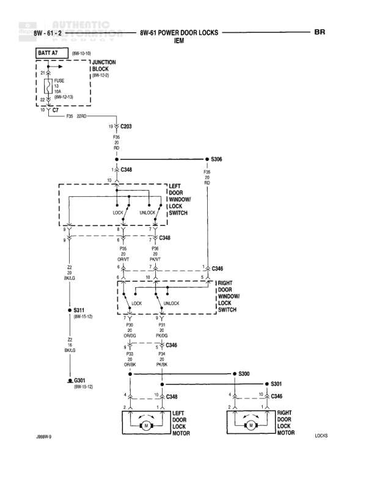

# POWER DOOR LOCKS - IEM - BR

**Notes:** Diagram shows power door lock system for BR model using IEM (Integrated Electronic Module). System includes left and right door lock motors controlled by window lock switches. Both switches can lock/unlock both doors. Motors are grounded through braided ground straps. J669W-2 reference indicates left door motor location.

## Components

| Component | Ref | Connectors | Notes |
|-----------|-----|------------|-------|
| BATT A7 | 8W-10-13 |  | Battery feed |
| JUNCTION BLOCK | 8W-15-3 |  | Contains FUSE 3 (10A) |
| LEFT DOOR WINDOW LOCK SWITCH | 8W-61-2 | C348 | LOCK and UNLOCK positions |
| RIGHT DOOR WINDOW LOCK SWITCH | 8W-61-2 | C346 | LOCK and UNLOCK positions |
| LEFT DOOR LOCK MOTOR | J669W-2 | C348 | Door lock actuator |
| RIGHT DOOR LOCK MOTOR | LOCKS | C346 | Door lock actuator |

## Wires

| From | To | Wire Code | Gauge | Color | Notes |
|------|-----|-----------|-------|-------|-------|
| BATT A7 | FUSE 3 (10A) | A2 | 12 | RD | From 8W-10-13 |
| FUSE 3 (10A) | C7 | A2 | 12 | RD | To C7 connector, 8W-10-13 |
| C7 | C203 | None | 12 | RD | ZIFO connection |
| C203 | C348 | None | 12 | RD | None |
| C348 | S306 | P26 | 20 | RD | From LEFT DOOR WINDOW LOCK SWITCH |
| LEFT DOOR WINDOW LOCK SWITCH (LOCK) | C348 | P26 | 20 | DB/WT | None |
| C348 | LEFT DOOR LOCK MOTOR pin 4 | P26 | 20 | DB/WT | None |
| LEFT DOOR WINDOW LOCK SWITCH (UNLOCK) | C348 | P26 | 20 | PK/WT | None |
| C348 | LEFT DOOR LOCK MOTOR pin 10 | P26 | 20 | PK/WT | None |
| LEFT DOOR WINDOW LOCK SWITCH pin 9 | S311 | None | 20 | BK/LG | Ground connection, 8W-15-12 |
| LEFT DOOR LOCK MOTOR pin 9 | BRAID | Z2 | 20 | BK/LG | None |
| C348 | C346 | P26 | 20 | DB/WT | From LEFT to RIGHT door |
| C348 | C346 | P26 | 20 | PK/WT | From LEFT to RIGHT door |
| C346 | S300 | None | 20 | DB/WT | None |
| S300 | S301 | None | 20 | PK/WT | None |
| C346 | RIGHT DOOR LOCK MOTOR pin 4 | None | 20 | DB/WT | None |
| C346 | RIGHT DOOR LOCK MOTOR pin 10 | None | 20 | PK/WT | None |
| RIGHT DOOR LOCK MOTOR pin 9 | BRAID | Z2 | 20 | BK/LG | None |
| S311 | BRAID | Z2 | 20 | BK/LG | 8W-15-12 |
| C301 | Ground | Z2 | 20 | BK/LG | 8W-15-12 |

## Splices & Grounds

| ID | Type | Location | Wires Connected | Notes |
|----|------|----------|-----------------|-------|
| S311 | splice | 8W-15-12 | Z2 | Ground splice |
| S306 | splice | Upper right of diagram | P26 | Power feed splice |
| S300 | splice | Right door circuit | P26 | Lock circuit splice |
| S301 | splice | Right door circuit | P26 | Unlock circuit splice |
| C301 | ground | 8W-15-12 |  | Main ground connection |
| BRAID | ground | Motor ground connections |  | Braided ground strap |

## Cross-References

- 8W-10-13
- 8W-15-3
- 8W-15-12
