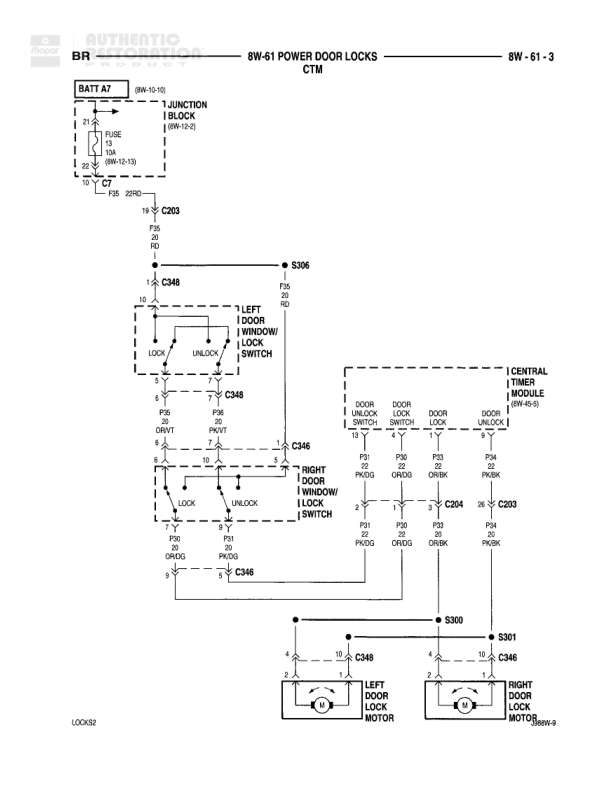

# POWER DOOR LOCKS CTM

**Notes:** Power door lock system with Central Timer Module (CTM) control. Left and right door lock motors are controlled through window lock switches and CTM. System includes lock and unlock functions for both front doors.

## Components

| Component | Ref | Connectors | Notes |
|-----------|-----|------------|-------|
| Battery A7 | BATT A7 |  | 8W-10-10 |
| Junction Block | 8W-40-2 |  | Contains Fuse 30A and 10A (8W-10-13) |
| Left Front Door Window Lock Switch | Left section of door controls | C348 | LOCK and UNLOCK positions |
| Right Front Door Window Lock Switch | Right section of door controls | C348 | LOCK and UNLOCK positions |
| Central Timer Module | CTM | C348, C304, C203 | Contains door unlock/lock switches |
| Left Door Lock Motor | 8W-61-2 | C348 | LOCK32 |
| Right Door Lock Motor | 8W-61-2 | C346 |  |

## Wires

| From | To | Wire Code | Gauge | Color | Notes |
|------|-----|-----------|-------|-------|-------|
| BATT A7 | FUSE 30A | A7 | 12 | RD |  |
| FUSE 30A | C7 | F36 | 10 | RD |  |
| FUSE 10A | C7 | F36 | 20 | RD | 8W-10-13 |
| C7 | C203 | F36 | 20 | RD |  |
| C203 | S306 | F36 | 20 | RD |  |
| S306 | C348 | F36 | 20 | RD |  |
| Left Door Window Lock Switch LOCK | C348 | P96 | 20 | GY/WT |  |
| Left Door Window Lock Switch UNLOCK | C348 | P91 | 20 | PK/WT |  |
| Right Door Window Lock Switch LOCK | C348 | P96 | 20 | GY/WT |  |
| Right Door Window Lock Switch UNLOCK | C348 | P91 | 20 | PK/WT |  |
| C348 | C346 | P96 | 20 | GY/WT |  |
| C348 | C346 | P91 | 20 | PK/WT |  |
| CTM Door Unlock Switch | C348 | P91 | 20 | PK/GY |  |
| CTM Door Lock Switch | C348 | P96 | 20 | OR/GR |  |
| CTM Door Lock | C304 | P93 | 20 | DR/GR |  |
| CTM Door Unlock | C203 | P94 | 20 | WT |  |
| C304 | C348 | P93 | 20 | DR/GR |  |
| C203 | C348 | P94 | 20 | PK/GY |  |
| C348 | S300 | P93 | 20 | DR/GR |  |
| S300 | S301 | P93 | 20 | DR/GR |  |
| S301 | C346 | P93 | 20 | DR/GR |  |
| C348 | Left Door Lock Motor | P94 | 20 | PK/GY |  |
| C346 | Right Door Lock Motor | P94 | 20 | PK/GY |  |

## Splices & Grounds

| ID | Type | Location | Wires Connected | Notes |
|----|------|----------|-----------------|-------|
| C7 | splice | Near junction block | F36 | Power distribution point |
| C203 | connector | Between C7 and S306 | F36, P94 |  |
| S306 | splice | Power distribution to door switches | F36 |  |
| C348 | connector | Left door area | F36, P96, P91, P93, P94 | Main connector for left door controls |
| C346 | connector | Right door area | P96, P91, P93, P94 | Main connector for right door controls |
| C304 | connector | CTM connection | P93 |  |
| S300 | splice | Lock circuit distribution | P93 |  |
| S301 | splice | Between S300 and C346 | P93 |  |

## Cross-References

- 8W-10-10
- 8W-40-2
- 8W-10-13
- 8W-61-2
