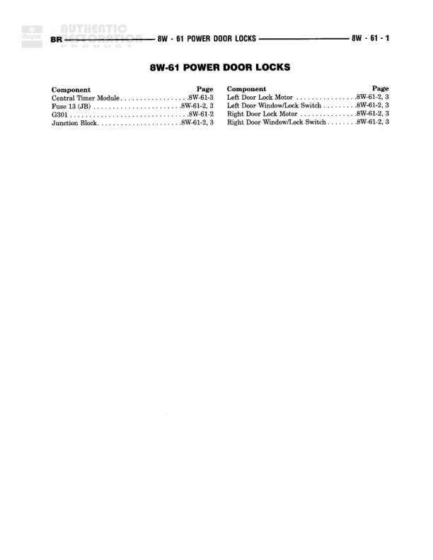

# POWER DOOR LOCKS

**Notes:** This is an index page for the Power Door Locks system. It lists components and their locations across diagrams 8W-61-2 and 8W-61-3. No actual wiring diagram is shown on this page - it serves as a navigation reference for the complete power door lock circuit details found on subsequent pages.

## Components

| Component | Ref | Connectors | Notes |
|-----------|-----|------------|-------|
| Central Power Module | 8W-61-3 |  | Index page reference |
| Fuse 13 (JB) | 8W-61-2, 3 |  | Junction Block fuse - Index page reference |
| G301 | 8W-61-2 |  | Ground point - Index page reference |
| Left Door Lock Motor | 8W-61-2, 3 |  | Index page reference |
| Left Door Window/Lock Switch | 8W-61-2, 3 |  | Index page reference |
| Right Door Lock Motor | 8W-61-2, 3 |  | Index page reference |
| Right Door Window/Lock Switch | 8W-61-2, 3 |  | Index page reference |

## Splices & Grounds

| ID | Type | Location | Wires Connected | Notes |
|----|------|----------|-----------------|-------|
| G301 | ground | Referenced on 8W-61-2 |  | Ground point for power door lock system |

## Cross-References

- 8W-61-2
- 8W-61-3
