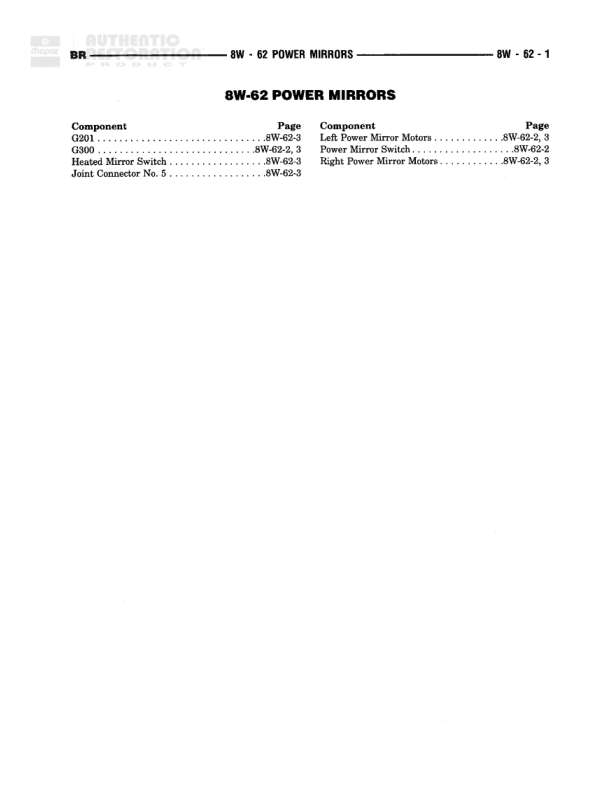

# POWER MIRRORS

**Notes:** This is an index/cover page for the Power Mirrors section. Actual wiring diagrams and connections are on subsequent pages 8W-62-2 and 8W-62-3.

## Components

| Component | Ref | Connectors | Notes |
|-----------|-----|------------|-------|
| G201 | 8W-62-3 |  | Ground point |
| G300 | 8W-62-2, 3 |  | Ground point |
| Heated Mirror Switch | 8W-62-3 |  |  |
| Left Power Mirror Motors | 8W-62-2, 3 |  |  |
| Power Mirror Switch | 8W-62-2 |  |  |
| Right Power Mirror Motors | 8W-62-2, 3 |  |  |
| Joint Connector No. 5 | 8W-62-3 |  |  |

## Cross-References

- 8W-62-2
- 8W-62-3
