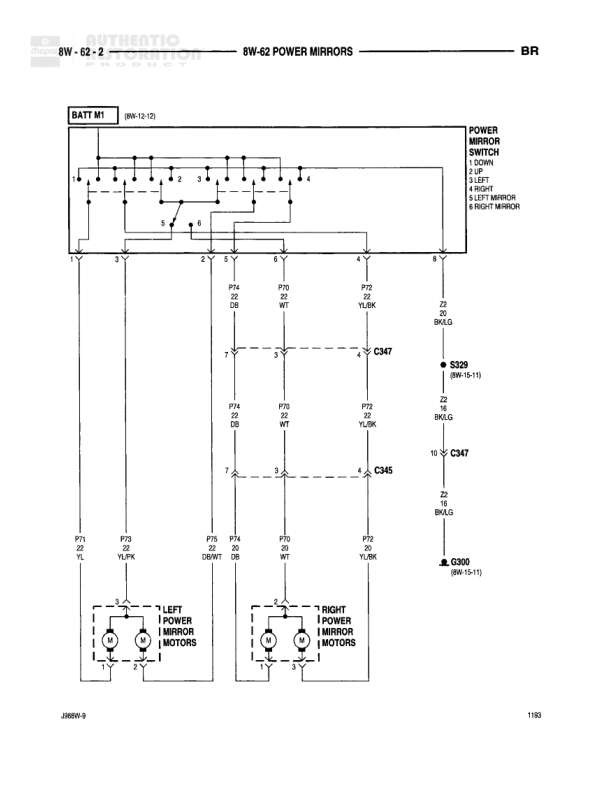

# 8W-62 POWER MIRRORS

**Notes:** Power mirror control circuit showing switch connections to left and right mirror motors. Switch controls up/down and left/right movement for both mirrors. Connections use C345 and C347 connectors to route signals to right mirror.

## Components

| Component | Ref | Connectors | Notes |
|-----------|-----|------------|-------|
| Battery M1 | 8W-13-13 |  | Battery feed source |
| Power Mirror Switch | 8W-62-2 |  | Controls: UP, DOWN, LEFT, RIGHT, LEFT MIRROR, RIGHT MIRROR |
| Left Power Mirror Motors | 8W-62-2 |  | Two motors for left mirror |
| Right Power Mirror Motors | 8W-62-2 |  | Two motors for right mirror |

## Wires

| From | To | Wire Code | Gauge | Color | Notes |
|------|-----|-----------|-------|-------|-------|
| BATT M1 | Power Mirror Switch pin 1 | A2 | 18 | RD/WT | Battery feed to switch |
| Power Mirror Switch pin 3 | Splice point Y | None | None | None | Internal switch connection |
| Power Mirror Switch P71 | Left mirror motor connector | P71 | 20 | YL/BK | To left mirror |
| Power Mirror Switch P73 | Left mirror motor connector | P73 | 20 | TN/BK | To left mirror |
| Power Mirror Switch P75 | Left mirror motor connector | P75 | 20 | BK/WT | To left mirror |
| Power Mirror Switch P74 | Connector C345 | P74 | 20 | DB | Connection through C345 |
| Power Mirror Switch P70 | Connector C347 | P70 | 20 | WT | Connection through C347 |
| Power Mirror Switch P72 | Connector C347 | P72 | 20 | YL/BK | Connection through C347 |
| C345 pin 3 | Right mirror motor | P74 | 20 | DB | To right mirror |
| C347 pin 10 | Right mirror motor | P70 | 20 | WT | To right mirror |
| C347 pin 4 | Right mirror motor | P72 | 20 | YL/BK | To right mirror |
| Power Mirror Switch pin 8 | Z2 wire | Z2 | 20 | BK/LG | Ground connection from switch |
| Z2 | S329 | Z2 | 20 | BK/LG | To splice S329 |
| S329 | C347 pin 10 | Z2 | 20 | BK/LG | Ground path through C347 |
| C347 | G300 | Z2 | 20 | BK/LG | Final ground connection |

## Splices & Grounds

| ID | Type | Location | Wires Connected | Notes |
|----|------|----------|-----------------|-------|
| S329 | splice | Between switch and connector C347 | Z2 | Reference: 8W-15-11 |
| G300 | ground | Final ground point |  | Reference: 8W-15-11 |

## Cross-References

- 8W-13-13
- 8W-15-11
