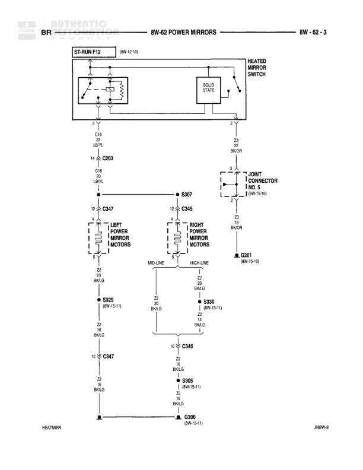

# POWER MIRRORS

**Notes:** Diagram shows power mirror circuit with heated mirror functionality. Includes mid-line and high-line configurations. HBREV-9 revision marking visible.

## Components

| Component | Ref | Connectors | Notes |
|-----------|-----|------------|-------|
| ST-RUN F12 | 8W-15-10 |  | Start-Run Fuse 12 |
| HEATED MIRROR SWITCH | diagram |  | Solid state switch |
| LEFT POWER MIRROR MOTORS | diagram | C347 | Mid-line configuration |
| RIGHT POWER MIRROR MOTORS | diagram | C345 | Mid-line and High-line configuration |
| JOINT CONNECTOR NO. 5 | 8W-15-10 |  |  |

## Wires

| From | To | Wire Code | Gauge | Color | Notes |
|------|-----|-----------|-------|-------|-------|
| ST-RUN F12 | C203 | C16 | 14 | LB/YL |  |
| C203 | C347 | C16 | 14 | BK/LG |  |
| C347 | LEFT POWER MIRROR MOTORS pin 5 | Z2 | 20 | BK/LG | Mid-line |
| C347 | S329 | Z2 | 20 | BK/LG |  |
| S329 | C345 | Z2 | 20 | BK/LG |  |
| C345 | RIGHT POWER MIRROR MOTORS | Z2 | 20 | BK/LG | High-line |
| C345 | S330 | Z2 | 20 | BK/LG |  |
| S330 | C345 | Z2 | 20 | BK/LG |  |
| C345 | S365 | Z2 | 20 | PK/LG |  |
| S365 | G300 | Z2 | 20 | PK/LG |  |
| C347 | G300 | Z2 | 16 | BK/LG |  |
| HEATED MIRROR SWITCH | SOLID STATE | Z2 | None | BK/OR |  |
| SOLID STATE | JOINT CONNECTOR NO. 5 pin 2 | None | None | None |  |
| JOINT CONNECTOR NO. 5 pin 1 | S307 | None | None | None |  |
| S307 | C347 pin 10 | None | None | None |  |
| S307 | C345 pin 10 | None | None | None |  |
| JOINT CONNECTOR NO. 5 | BK/OR | Z2 | 18 | BK/OR |  |

## Splices & Grounds

| ID | Type | Location | Wires Connected | Notes |
|----|------|----------|-----------------|-------|
| C203 | connector | inline between ST-RUN F12 and C347 | C16 |  |
| C347 | connector | Left Power Mirror Motors | C16, Z2 | Mid-line configuration |
| C345 | connector | Right Power Mirror Motors | Z2 | Mid-line and High-line configuration |
| S329 | splice | between left and right mirror circuits | Z2 | 8W-15-11 |
| S330 | splice | right mirror circuit | Z2 | 8W-15-11 |
| S365 | splice | near ground connection | Z2 | 8W-15-11 |
| S307 | splice | heated mirror circuit |  | Connects to both C347 and C345 |
| G300 | ground | ground point |  | 8W-15-11 |

## Cross-References

- 8W-15-10
- 8W-15-11
