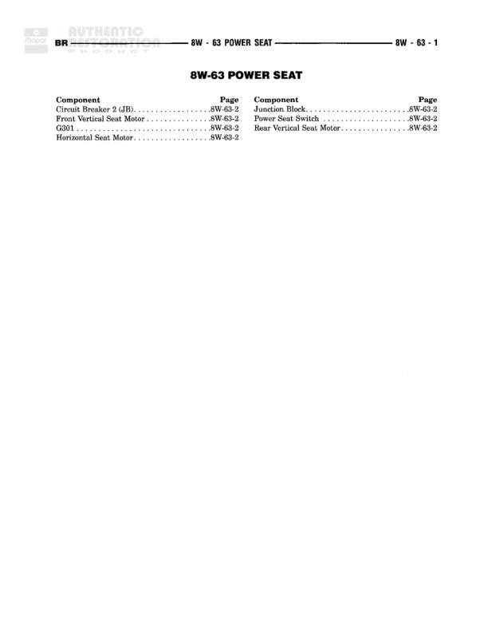

# POWER SEAT

**Notes:** This is an index/contents page for the 8W-63 POWER SEAT section. All actual wiring diagram details are located on page 8W-63-2.

## Components

| Component | Ref | Connectors | Notes |
|-----------|-----|------------|-------|
| Circuit Breaker 2 (JB) | 8W-63-2 |  | Junction Block Circuit Breaker |
| Front Vertical Seat Motor | 8W-63-2 |  |  |
| G801 | 8W-63-2 |  |  |
| Horizontal Seat Motor | 8W-63-2 |  |  |
| Junction Block | 8W-63-2 |  |  |
| Power Seat Switch | 8W-63-2 |  |  |
| Rear Vertical Seat Motor | 8W-63-2 |  |  |

## Cross-References

- 8W-63-2
