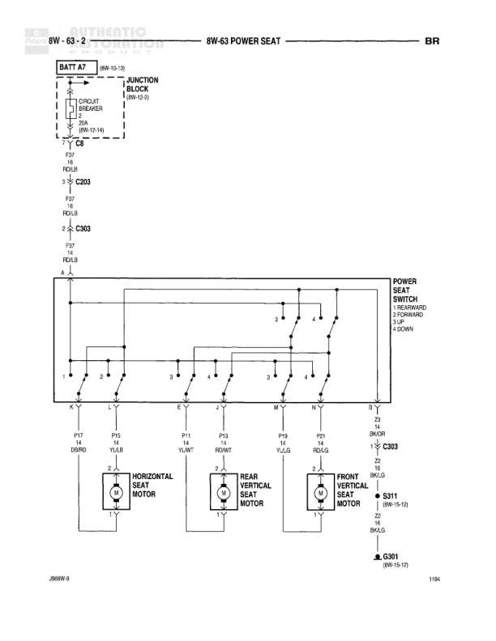

# POWER SEAT

**Notes:** Power seat control circuit showing horizontal and vertical (front/rear) seat motor control through multi-position switch. All motors receive power through a single 20A circuit breaker in the junction block. Ground path goes through S311 splice to G301.

## Components

| Component | Ref | Connectors | Notes |
|-----------|-----|------------|-------|
| BATT A7 | 8W-10-10 |  | Battery feed source |
| JUNCTION BLOCK | 8W-12-8 |  | Contains circuit breaker |
| CIRCUIT BREAKER | Inside Junction Block |  | 20A circuit breaker |
| POWER SEAT SWITCH | Central component |  | FWD/REARWARD, UP/DOWN, F/R DOWN controls |
| HORIZONTAL SEAT MOTOR | Left motor assembly | P17, P18 | Controls forward/rearward seat movement |
| REAR VERTICAL SEAT MOTOR | Center motor assembly | P11, P13 | Controls rear vertical seat movement |
| FRONT VERTICAL SEAT MOTOR | Right motor assembly | P9, P21 | Controls front vertical seat movement |

## Wires

| From | To | Wire Code | Gauge | Color | Notes |
|------|-----|-----------|-------|-------|-------|
| BATT A7 | JUNCTION BLOCK | None | None | BK/10 | Battery feed to junction block |
| JUNCTION BLOCK | C8 | A | 20 | None | 8W-12-14 |
| C8 | C203 | F17 | None | RD/LB |  |
| C203 | C403 | F17 | None | RD/LB |  |
| C403 | Power Seat Switch A | A | None | None |  |
| Power Seat Switch K | P17 GNBK (Horizontal Seat Motor) | None | None | GN/BK |  |
| Power Seat Switch L | P18 YLBR (Horizontal Seat Motor) | None | None | YL/BR |  |
| Power Seat Switch E | P11 VTBK (Rear Vertical Seat Motor) | None | None | VT/BK |  |
| Power Seat Switch J | P13 WTBK (Rear Vertical Seat Motor) | None | None | WT/BK | 8W-12-12 |
| Power Seat Switch M | P9 LBBK (Front Vertical Seat Motor) | None | None | LB/BK |  |
| Power Seat Switch N | P21 PKBK (Front Vertical Seat Motor) | None | None | PK/BK | 8W-12-13 |
| Power Seat Switch S | C303 | Z2 | None | BKOR |  |
| C303 | S311 | Z2 | None | BK/LB | 8W-14-12 |
| S311 | G301 | Z2 | None | BK/LB | 8W-14-12 |

## Splices & Grounds

| ID | Type | Location | Wires Connected | Notes |
|----|------|----------|-----------------|-------|
| S311 | splice | Between C303 and G301 | Z2 | 8W-14-12 |
| G301 | ground | Ground point for seat circuits |  | 8W-14-12 |

## Cross-References

- 8W-10-10
- 8W-12-8
- 8W-12-14
- 8W-12-12
- 8W-12-13
- 8W-14-12
