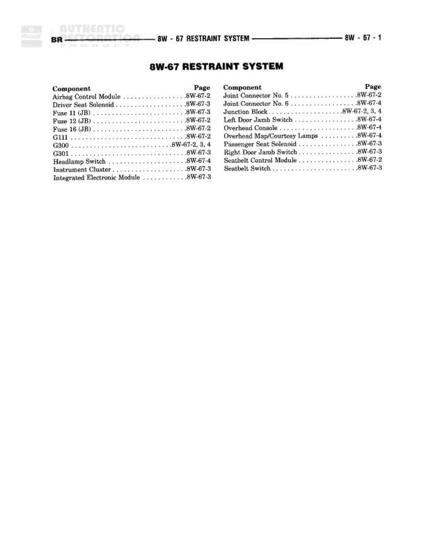

# RESTRAINT SYSTEM - Component Index

**Notes:** This is a component index page for the restraint system. It lists all components and their corresponding diagram page references. Actual wiring connections are shown on pages 8W-67-2, 8W-67-3, and 8W-67-4.

## Components

| Component | Ref | Connectors | Notes |
|-----------|-----|------------|-------|
| Driver Control Module | 8W-67-3 |  | Driver-side restraint control |
| Driver Seat Solenoid | 8W-67-3 |  | Driver seat belt solenoid |
| Fuse 11 (JB) | 8W-67-3 |  | Junction Block fuse |
| Fuse 12 (JB) | 8W-67-2 |  | Junction Block fuse |
| Fuse 16 (JB) | 8W-67-2 |  | Junction Block fuse |
| G111 | 8W-60-3 |  | Ground point |
| G300 | 8W-67-2, 3, 4 |  | Ground point |
| Headlamp Switch | 8W-67-3 |  | Related to restraint system monitoring |
| Headlamp Switch | 8W-67-4 |  | Related to restraint system monitoring |
| Instrument Cluster | 8W-67-3 |  | Displays restraint system information |
| Integrated Electronic Module | 8W-67-3 |  | Central control module |
| Joint Connector No. 5 | 8W-67-2 |  | Wiring junction point |
| Joint Connector No. 6 | 8W-67-4 |  | Wiring junction point |
| Junction Block | 8W-67-2, 3, 4 |  | Main power distribution block |
| Left Door Jamb Switch | 8W-67-4 |  | Door status monitoring |
| Overhead Console | 8W-67-4 |  | Contains restraint system indicators |
| Passenger Control Module | 8W-67-4 |  | Passenger-side restraint control |
| Passenger Seat Solenoid | 8W-67-3 |  | Passenger seat belt solenoid |
| Right Door Jamb Switch | 8W-67-3 |  | Door status monitoring |
| Seatbelt Control Module | 8W-67-2 |  | Main restraint system controller |
| Seatbelt Switch | 8W-67-3 |  | Seatbelt buckle status sensor |

## Cross-References

- 8W-67-2
- 8W-67-3
- 8W-67-4
- 8W-60-3
