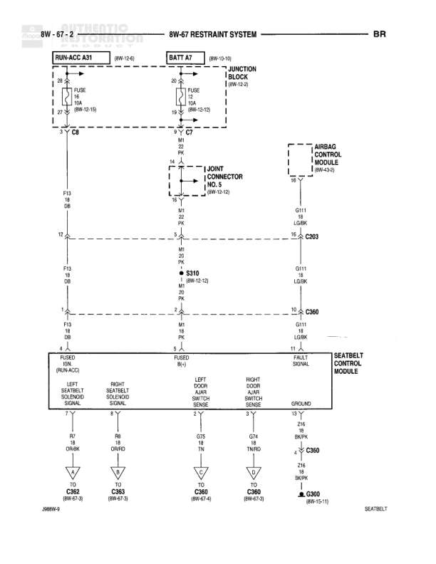

# RESTRAINT SYSTEM

**Notes:** Diagram shows restraint system including airbag and seatbelt control modules. Multiple connections to seatbelt deployment sensors via C360 connector. J969W-4 reference noted at bottom.

## Components

| Component | Ref | Connectors | Notes |
|-----------|-----|------------|-------|
| RUN/ACC A31 | 8W-10-6 |  | Power distribution point |
| BATT A7 | 8W-10-10 |  | Battery power distribution point |
| JUNCTION BLOCK | 8W-12-2 |  | Contains FUSE 3 and FUSE 4 |
| AIRBAG CONTROL MODULE | 8W-43-2 |  |  |
| SEATBELT CONTROL MODULE |  |  | Controls left and right floor/knee seatbelt deploy signals |

## Wires

| From | To | Wire Code | Gauge | Color | Notes |
|------|-----|-----------|-------|-------|-------|
| RUN/ACC A31 | C9 Pin 20 | F13 | 18 | OR |  |
| BATT A7 | JUNCTION BLOCK FUSE 3 | A2 | 18 | PK |  |
| JUNCTION BLOCK FUSE 3 | C7 Pin 19 | A2 | 18 | PK |  |
| C9 Pin 20 | JOINT CONNECTOR NO. 5 Pin 16 | F13 | 18 | OR |  |
| JOINT CONNECTOR NO. 5 Pin 16 | S310 | F13 | 18 | OR |  |
| S310 | Seatbelt Control Module Pin 4 | F13 | 18 | OR |  |
| C7 Pin 19 | Airbag Control Module Pin 16 | A2 | 18 | PK |  |
| Airbag Control Module Pin 16 | C303 | A2 | 18 | PK |  |
| C303 | C360 Pin 4 | A2 | 18 | PK |  |
| C360 Pin 4 | Seatbelt Control Module | A2 | 18 | PK |  |
| Airbag Control Module G311 (LG/BK) | C303 |  | 18 | LG/BK | Ground connection |
| C303 | C360 |  | 18 | LG/BK | Ground connection |
| Seatbelt Control Module Pin 1 | C360 |  | 18 | OR/WT | Left Floor Seatbelt Deploy Signal |
| C360 | TO C360 (8W-67-3) |  | 18 | OR/WT |  |
| Seatbelt Control Module Pin 3 | C360 |  | 18 | OR/WT | Right Seatbelt Deploy Signal |
| C360 | TO C360 (8W-67-3) |  | 18 | OR/WT |  |
| Seatbelt Control Module Pin 12 | C360 |  | 18 | TN | Left Knee Seatbelt Deploy Sense |
| C360 | TO C360 (8W-67-4) |  | 18 | TN |  |
| Seatbelt Control Module Pin 8 | C360 |  | 18 | TN/RD | Right Knee Seatbelt Deploy Sense |
| C360 | TO C360 (8W-67-3) |  | 18 | TN/RD |  |
| Seatbelt Control Module Pin 13 | G300 (8W-15-11) |  | 18 | BK/WT | Ground |

## Splices & Grounds

| ID | Type | Location | Wires Connected | Notes |
|----|------|----------|-----------------|-------|
| S310 | splice | 8W-12-12 | F13 | Splits power feed to multiple circuits |
| G311 | ground | LG/BK |  | Airbag Control Module ground |
| G300 | ground | 8W-15-11 |  | Seatbelt Control Module ground |
| C9 | connector |  | F13 | Junction block connector |
| C7 | connector |  | A2 | Junction block connector |
| C303 | connector |  | A2, LG/BK | In-line connector |
| C360 | connector |  | A2, LG/BK, OR/WT, TN, TN/RD | Main seatbelt control module connector |

## Cross-References

- 8W-10-6
- 8W-10-10
- 8W-12-2
- 8W-12-12
- 8W-43-2
- 8W-67-3
- 8W-67-4
- 8W-15-11
