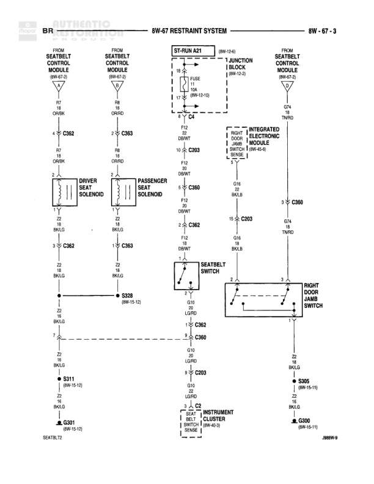

# RESTRAINT SYSTEM

**Notes:** This diagram shows the restraint system including driver and passenger seatbelt control modules, seat solenoids, seatbelt switch, and right door ajar switch. The system is powered through ST-RUN A21 with a 10A fuse and interfaces with the Integrated Electronic Module and Instrument Cluster.

## Components

| Component | Ref | Connectors | Notes |
|-----------|-----|------------|-------|
| Seatbelt Control Module (Driver Side) | 8W-67-2 | C362 | From diagram 8W-67-2 |
| Seatbelt Control Module (Passenger Side) | 8W-67-2 | C363 | From diagram 8W-67-2 |
| Seatbelt Control Module | 8W-67-2 | C360 | From diagram 8W-67-2 |
| ST-RUN A21 | Junction Block |  | 8W-12-10, FUSE 10A, 8W-10-108 |
| 1 JUNCTION BLOCK | Junction Block |  | 8W-12-10 |
| Driver Seat Solenoid | None |  | None |
| Passenger Seat Solenoid | None |  | None |
| Seatbelt Switch | None |  | None |
| Right Door Ajar Switch | None |  | None |
| Integrated Electronic Module | 8W-45-6 |  | INPUT, DOOR, SWITCH, INPUT, SENSE |
| Instrument Cluster | 8W-52-3 |  | SEAT BELT SWITCH SENSE |

## Wires

| From | To | Wire Code | Gauge | Color | Notes |
|------|-----|-----------|-------|-------|-------|
| Seatbelt Control Module (8W-67-2) | C362 Pin 19 | F12 | 18 | LG/WT | None |
| C362 Pin 19 | C362 Pin 7 | F12 | 18 | LG/WT | CR/BK |
| C362 Pin 7 | Driver Seat Solenoid Pin 2 | F12 | 18 | OR/BK | None |
| Driver Seat Solenoid Pin 1 | C362 Pin 3 | Z2 | 18 | BK/LG | None |
| C362 Pin 3 | Z2 | Z2 | 18 | BK/LG | None |
| Seatbelt Control Module (8W-67-2) | C363 Pin 18 | F12 | 18 | OR/RD | None |
| C363 Pin 18 | Passenger Seat Solenoid Pin 2 | F12 | 18 | OR/RD | None |
| Passenger Seat Solenoid Pin 1 | C363 Pin 1 | Z2 | 18 | BK/LG | None |
| C363 Pin 1 | Z2 | Z2 | 18 | BK/LG | None |
| ST-RUN A21 FUSE 10A | C203 Pin 10 | F12 | 18 | LG/WT | None |
| C203 Pin 10 | C360 Pin 19 | F12 | 18 | LG/WT | None |
| Integrated Electronic Module (8W-45-6) | C360 Pin 16 | None | 18 | BK/LB | INPUT, DOOR, SWITCH, INPUT, SENSE |
| C360 Pin 16 | C203 Pin 15 | Q16 | 18 | BK/LB | None |
| C360 Pin 20 | C362 Pin 5 | F12 | 18 | LG/WT | None |
| C362 Pin 5 | S329 | F12 | 18 | LG/WT | 8W-10-108 |
| C362 Pin 1 | Seatbelt Switch Pin 2 | Q10 | 20 | LG/RD | None |
| Seatbelt Switch Pin 1 | C362 Pin 3 | Q10 | 20 | LG/RD | None |
| C362 Pin 3 | C360 Pin 3 | Q10 | 20 | LG/RD | None |
| C360 Pin 3 | Right Door Ajar Switch Pin 2 | Q10 | 20 | LG/RD | None |
| Right Door Ajar Switch Pin 3 | C360 Pin 5 | Z2 | 18 | BK/LG | None |
| C362 Pin 7 | S311 | Z2 | 18 | BK/LG | 8W-15-19 |
| C203 Pin 9 | Ground | Q10 | 20 | LG/RD | None |
| C360 Pin 5 | S365 | Z2 | 18 | BK/LG | 8W-15-11 |
| S311 | G301 | Z2 | 18 | BK/LG | 8W-15-12, SEATBELT |
| S365 | G300 | Z2 | 18 | BK/LG | 8W-15-11 |
| Instrument Cluster (8W-52-3) | C203 | None | None | None | SEAT BELT SWITCH SENSE |

## Splices & Grounds

| ID | Type | Location | Wires Connected | Notes |
|----|------|----------|-----------------|-------|
| S329 | splice | 8W-10-108 | F12 | None |
| S311 | splice | 8W-15-19 | Z2 | None |
| S365 | splice | 8W-15-11 | Z2 | None |
| G301 | ground | 8W-15-12 |  | SEATBELT |
| G300 | ground | 8W-15-11 |  | None |

## Cross-References

- 8W-67-2
- 8W-12-10
- 8W-10-108
- 8W-45-6
- 8W-52-3
- 8W-15-19
- 8W-15-11
- 8W-15-12
