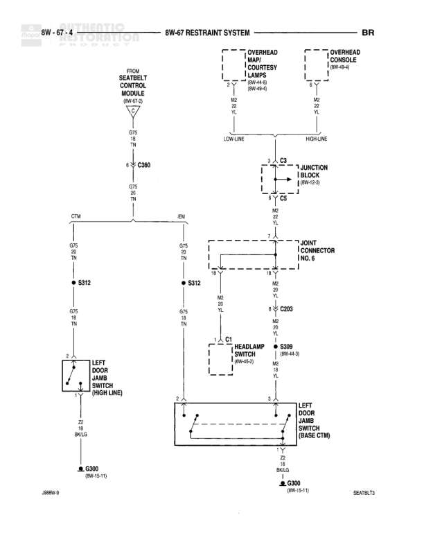

# RESTRAINT SYSTEM

**Notes:** Diagram shows restraint system wiring including interior lighting control through door jamb switches. Two configurations shown: HIGH LINE (through left door jamb switch) and BASE CTM (base courtesy module). Circuit includes connections from Body Control Module to overhead lamps and door jamb switches with ground returns.

## Components

| Component | Ref | Connectors | Notes |
|-----------|-----|------------|-------|
| OVERHEAD MAP/COURTESY LAMPS | 8W-44-8, 8W-48-4 |  | Two lamps shown - overhead and overhead console |
| OVERHEAD CONSOLE LAMP | 8W-49-4 |  |  |
| BODY CONTROL MODULE | 8W-67-2 | C360 |  |
| JUNCTION BLOCK | 8W-12-3 | C9, C5 |  |
| JOINT CONNECTOR NO. 6 |  |  |  |
| HEADLAMP SWITCH | 8W-40-3 | C1 |  |
| LEFT DOOR JAMB SWITCH (HIGH LINE) |  |  |  |
| LEFT DOOR JAMB SWITCH (BASE CTM) |  |  |  |

## Wires

| From | To | Wire Code | Gauge | Color | Notes |
|------|-----|-----------|-------|-------|-------|
| BODY CONTROL MODULE/C360 Pin CF5 | S312 | M2 | 18 | TN |  |
| C360 Pin CF5 | OVERHEAD MAP/COURTESY LAMPS | M2 | 18 | TN | LOW-LINE |
| OVERHEAD MAP/COURTESY LAMPS | OVERHEAD CONSOLE LAMP | M2 | 18 | TN | HIGH-LINE |
| C360 Pin G75 | S312 | M3 | 18 | TN |  |
| C360 Pin CTM | S312 | M3 | 18 | TN |  |
| C360 Pin EN | S312 | M3 | 18 | TN |  |
| S312 | LEFT DOOR JAMB SWITCH (HIGH LINE) Pin 1 | M3 | 18 | TN |  |
| S312 | JOINT CONNECTOR NO. 6 | M3 | 18 | TN |  |
| JOINT CONNECTOR NO. 6 | C209 | M2 | 18 | TN |  |
| JUNCTION BLOCK C9 | C5 | M2 | 18 | TN |  |
| C5 | JOINT CONNECTOR NO. 6 | M2 | 18 | TN |  |
| C209 | HEADLAMP SWITCH C1 | M2 | 18 | TN |  |
| C209 | S309 | M2 | 18 | TN | 8W-44-3 |
| S309 | LEFT DOOR JAMB SWITCH (BASE CTM) Pin 3 | M2 | 18 | TN |  |
| LEFT DOOR JAMB SWITCH (HIGH LINE) Pin 2 | C300 | Z2 | 22 | BK/LG | 8W-15-11 |
| LEFT DOOR JAMB SWITCH (BASE CTM) Pin 1 | C300 | Z2 | 22 | BK/LG | 8W-15-11 |

## Splices & Grounds

| ID | Type | Location | Wires Connected | Notes |
|----|------|----------|-----------------|-------|
| S312 | splice | Interior - connects multiple M3 wires | M3 | Distributes door jamb switch signal |
| S309 | splice | Interior | M2 | Reference 8W-44-3 |
| C209 | splice | Interior | M2 |  |
| C300 | ground | 8W-15-11 |  | Ground connection for door jamb switches |

## Cross-References

- 8W-67-2
- 8W-44-8
- 8W-48-4
- 8W-49-4
- 8W-12-3
- 8W-40-3
- 8W-44-3
- 8W-15-11
