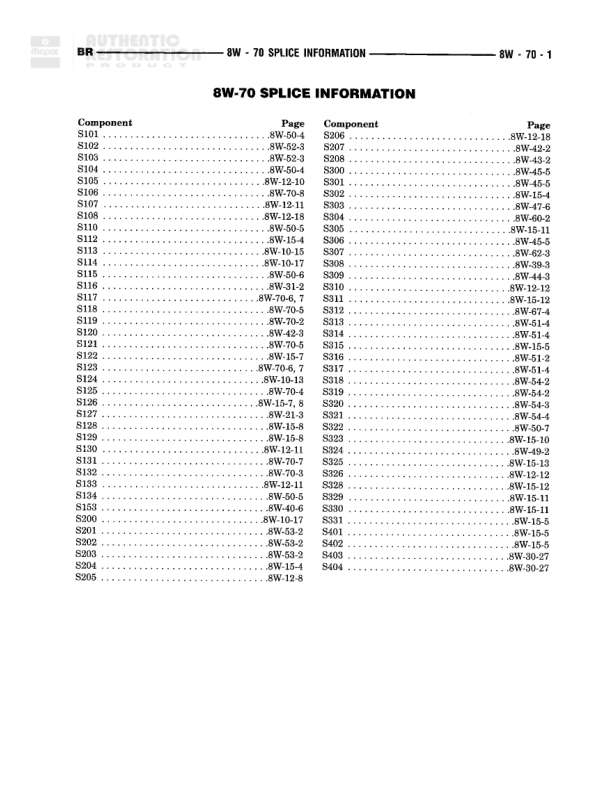

# SPLICE INFORMATION

**Notes:** This is a splice information index page that provides reference locations for all splice points used throughout the 8W series wiring diagrams. Each splice ID is cross-referenced to its corresponding diagram page location.

## Splices & Grounds

| ID | Type | Location | Wires Connected | Notes |
|----|------|----------|-----------------|-------|
| S101 | splice | 8W-50-1 |  |  |
| S102 | splice | 8W-52-3 |  |  |
| S103 | splice | 8W-52-3 |  |  |
| S104 | splice | 8W-50-4 |  |  |
| S105 | splice | 8W-12-10 |  |  |
| S106 | splice | 8W-70-5 |  |  |
| S107 | splice | 8W-12-11 |  |  |
| S108 | splice | 8W-12-18 |  |  |
| S110 | splice | 8W-50-5 |  |  |
| S112 | splice | 8W-15-4 |  |  |
| S113 | splice | 8W-10-15 |  |  |
| S114 | splice | 8W-10-17 |  |  |
| S115 | splice | 8W-50-6 |  |  |
| S116 | splice | 8W-31-2 |  |  |
| S117 | splice | 8W-70-6, 7 |  |  |
| S118 | splice | 8W-70-5 |  |  |
| S119 | splice | 8W-70-2 |  |  |
| S120 | splice | 8W-70-3 |  |  |
| S121 | splice | 8W-70-5 |  |  |
| S122 | splice | 8W-15-7 |  |  |
| S123 | splice | 8W-70-6, 7 |  |  |
| S124 | splice | 8W-10-11 |  |  |
| S125 | splice | 8W-70-4 |  |  |
| S126 | splice | 8W-10-7, 8 |  |  |
| S127 | splice | 8W-70-4 |  |  |
| S128 | splice | 8W-15-8 |  |  |
| S129 | splice | 8W-15-8 |  |  |
| S130 | splice | 8W-12-11 |  |  |
| S131 | splice | 8W-70-7 |  |  |
| S132 | splice | 8W-70-3 |  |  |
| S133 | splice | 8W-12-11 |  |  |
| S134 | splice | 8W-50-5 |  |  |
| S153 | splice | 8W-40-6 |  |  |
| S200 | splice | 8W-10-17 |  |  |
| S201 | splice | 8W-51-4 |  |  |
| S202 | splice | 8W-53-2 |  |  |
| S203 | splice | 8W-53-2 |  |  |
| S204 | splice | 8W-15-4 |  |  |
| S205 | splice | 8W-12-8 |  |  |
| S206 | splice | 8W-12-18 |  |  |
| S207 | splice | 8W-42-2 |  |  |
| S208 | splice | 8W-43-2 |  |  |
| S800 | splice | 8W-44-5 |  |  |
| S801 | splice | 8W-45-5 |  |  |
| S802 | splice | 8W-12-4 |  |  |
| S803 | splice | 8W-47-2 |  |  |
| S804 | splice | 8W-60-6 |  |  |
| S805 | splice | 8W-62-3 |  |  |
| S809 | splice | 8W-50-8 |  |  |
| S810 | splice | 8W-12-12 |  |  |
| S811 | splice | 8W-15-12 |  |  |
| S812 | splice | 8W-67-4 |  |  |
| S813 | splice | 8W-51-4 |  |  |
| S814 | splice | 8W-70-4 |  |  |
| S815 | splice | 8W-31-5 |  |  |
| S816 | splice | 8W-15-12 |  |  |
| S817 | splice | 8W-51-4 |  |  |
| S818 | splice | 8W-52-2 |  |  |
| S819 | splice | 8W-54-2 |  |  |
| S820 | splice | 8W-54-4 |  |  |
| S821 | splice | 8W-54-4 |  |  |
| S822 | splice | 8W-50-7 |  |  |
| S823 | splice | 8W-15-10 |  |  |
| S824 | splice | 8W-43-2 |  |  |
| S825 | splice | 8W-15-13 |  |  |
| S826 | splice | 8W-12-12 |  |  |
| S828 | splice | 8W-15-12 |  |  |
| S829 | splice | 8W-15-11 |  |  |
| S830 | splice | 8W-15-11 |  |  |
| S831 | splice | 8W-15-5 |  |  |
| S401 | splice | 8W-15-5 |  |  |
| S402 | splice | 8W-15-5 |  |  |
| S403 | splice | 8W-15-5 |  |  |
| S404 | splice | 8W-30-27 |  |  |
