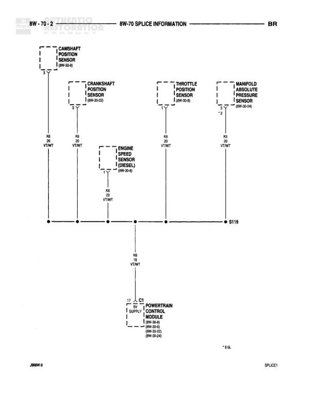

# SPLICE INFORMATION - BR

**Notes:** This diagram shows splice S119 which distributes the K6 (VT/WT) supply voltage from the Powertrain Control Module to various engine sensors. * B.DL. notation appears at bottom. Diagram number 28MM-5 and SPLICE1 noted at bottom.

## Components

| Component | Ref | Connectors | Notes |
|-----------|-----|------------|-------|
| CAMSHAFT POSITION SENSOR | 8W-30-8 |  | None |
| CRANKSHAFT POSITION SENSOR | 8W-30-25 |  | None |
| ENGINE SPEED SENSOR (DIESEL) | 8W-30-26 |  | None |
| THROTTLE POSITION SENSOR | 8W-30-9 |  | None |
| MANIFOLD ABSOLUTE PRESSURE SENSOR | 8W-30-34 |  | None |
| POWERTRAIN CONTROL MODULE | 8W-30-8, 8W-30-25, 8W-30-26, 8W-30-9, 8W-30-21 | C1 | 17 SUPPLY |

## Wires

| From | To | Wire Code | Gauge | Color | Notes |
|------|-----|-----------|-------|-------|-------|
| CAMSHAFT POSITION SENSOR | S119 | K6 | 22 | VT/WT | None |
| CRANKSHAFT POSITION SENSOR | S119 | K6 | 22 | VT/WT | None |
| ENGINE SPEED SENSOR (DIESEL) | S119 | K6 | 22 | VT/WT | None |
| THROTTLE POSITION SENSOR | S119 | K6 | 22 | VT/WT | None |
| MANIFOLD ABSOLUTE PRESSURE SENSOR | S119 | K6 | 22 | VT/WT | None |
| S119 | POWERTRAIN CONTROL MODULE C1 | K6 | 22 | VT/WT | None |

## Splices & Grounds

| ID | Type | Location | Wires Connected | Notes |
|----|------|----------|-----------------|-------|
| S119 | splice | central junction point | K6 | Connects all sensors to PCM supply circuit |

## Cross-References

- 8W-30-8
- 8W-30-25
- 8W-30-26
- 8W-30-9
- 8W-30-34
- 8W-30-21
