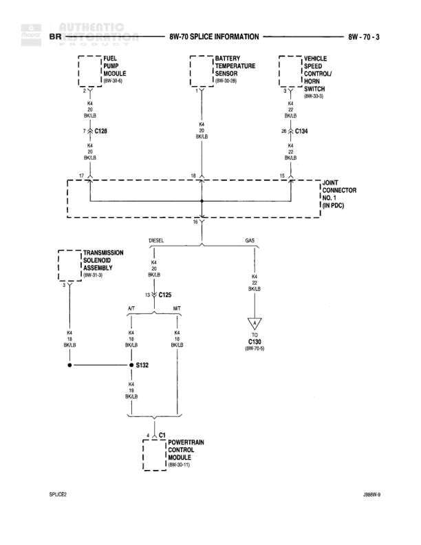

# SPLICE INFORMATION

**Notes:** This diagram shows splice information for the powertrain control system, with separate paths for diesel and gas configurations. The main splice is Joint Connector No. 1 located in the PDC (Power Distribution Center). Wire K4 (BK/LB - Black with Light Blue tracer) is the primary circuit shown.

## Components

| Component | Ref | Connectors | Notes |
|-----------|-----|------------|-------|
| Fuse/Pump Run/Fuel Pump Module | 8W-30-6 |  | None |
| Battery Temperature Sensor | 8W-30-86 |  | None |
| Vehicle Speed Control/Horn Switch | 8W-50-9 |  | None |
| Joint Connector No. 1 | IN PDC |  | In Power Distribution Center |
| Transmission Solenoid Assembly | 8W-9-1 |  | Diesel only |
| Powertrain Control Module | 8W-60-11 | C1 | None |

## Wires

| From | To | Wire Code | Gauge | Color | Notes |
|------|-----|-----------|-------|-------|-------|
| Fuse/Pump Run/Fuel Pump Module | C128 | K4 | 20 | BK/LB | None |
| C128 | Joint Connector No. 1 | K4 | 14 | BK/LB | None |
| Battery Temperature Sensor | Joint Connector No. 1 | K4 | 22 | BK/LB | None |
| Vehicle Speed Control/Horn Switch | C134 | K4 | 20 | BK/LB | None |
| C134 | Joint Connector No. 1 | K4 | 14 | BK/LB | None |
| Joint Connector No. 1 | C125 (DIESEL) | K4 | 18 | BK/LB | Diesel path |
| Joint Connector No. 1 | C130 (GAS) | K4 | 22 | BK/LB | Gas path |
| C125 | S132 (AT) | K4 | 18 | BK/LB | Automatic Transmission |
| C125 | S132 (MT) | K4 | 18 | BK/LB | Manual Transmission |
| Transmission Solenoid Assembly | S132 | K4 | 18 | BK/LB | None |
| S132 | Powertrain Control Module C1 | K4 | 18 | BK/LB | None |

## Splices & Grounds

| ID | Type | Location | Wires Connected | Notes |
|----|------|----------|-----------------|-------|
| C128 | splice | Between Fuse Module and Joint Connector | K4 | Connects Fuse Module to Joint Connector No. 1 |
| C134 | splice | Between Speed Control and Joint Connector | K4 | Connects Speed Control to Joint Connector No. 1 |
| C125 | splice | Diesel path junction | K4 | Splits to AT and MT paths, connects to S132 |
| S132 | splice | Diesel transmission path | K4 | Connects transmission solenoid and both transmission types to PCM |
| C130 | ground | Gas path |  | Reference 8W-70-5 |

## Cross-References

- 8W-30-6
- 8W-30-86
- 8W-50-9
- 8W-9-1
- 8W-60-11
- 8W-70-5
