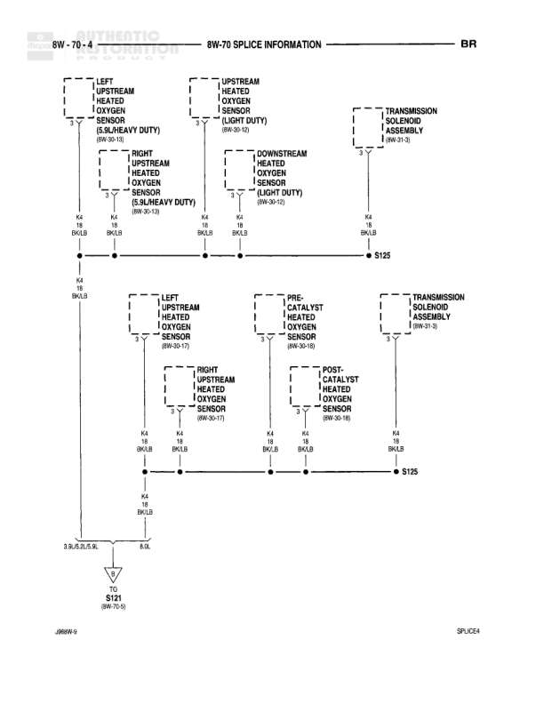

# SPLICE INFORMATION

**Notes:** This diagram shows splice connections for oxygen sensors and transmission solenoid assembly, with different configurations for 5.9L Heavy Duty and Light Duty variants. All connections use K4 18 BK/LB wire code.

## Components

| Component | Ref | Connectors | Notes |
|-----------|-----|------------|-------|
| LEFT UPSTREAM HEATED OXYGEN SENSOR (5.9L/HEAVY DUTY) | 8W-30-15 |  | None |
| RIGHT UPSTREAM HEATED OXYGEN SENSOR (5.9L/HEAVY DUTY) | 8W-30-15 |  | None |
| UPSTREAM HEATED OXYGEN SENSOR (LIGHT DUTY) | 8W-30-12 |  | None |
| DOWNSTREAM HEATED OXYGEN SENSOR (LIGHT DUTY) | 8W-30-12 |  | None |
| TRANSMISSION SOLENOID ASSEMBLY | 8W-31-3 |  | None |
| LEFT UPSTREAM HEATED OXYGEN SENSOR | 8W-30-11 |  | None |
| RIGHT UPSTREAM HEATED OXYGEN SENSOR | 8W-30-11 |  | None |
| PRE-CATALYST HEATED OXYGEN SENSOR | 8W-30-11 |  | None |
| POST-CATALYST HEATED OXYGEN SENSOR | 8W-30-11 |  | None |

## Wires

| From | To | Wire Code | Gauge | Color | Notes |
|------|-----|-----------|-------|-------|-------|
| LEFT UPSTREAM HEATED OXYGEN SENSOR (5.9L/HEAVY DUTY) | S125 | K4 | 18 | BK/LB | None |
| RIGHT UPSTREAM HEATED OXYGEN SENSOR (5.9L/HEAVY DUTY) | S125 | K4 | 18 | BK/LB | None |
| UPSTREAM HEATED OXYGEN SENSOR (LIGHT DUTY) | S125 | K4 | 18 | BK/LB | None |
| DOWNSTREAM HEATED OXYGEN SENSOR (LIGHT DUTY) | S125 | K4 | 18 | BK/LB | None |
| TRANSMISSION SOLENOID ASSEMBLY | S125 | K4 | 18 | BK/LB | None |
| LEFT UPSTREAM HEATED OXYGEN SENSOR | S125 | K4 | 18 | BK/LB | None |
| RIGHT UPSTREAM HEATED OXYGEN SENSOR | S125 | K4 | 18 | BK/LB | None |
| PRE-CATALYST HEATED OXYGEN SENSOR | S125 | K4 | 18 | BK/LB | None |
| POST-CATALYST HEATED OXYGEN SENSOR | S125 | K4 | 18 | BK/LB | None |
| TRANSMISSION SOLENOID ASSEMBLY (lower) | S125 | K4 | 18 | BK/LB | None |
| S125 | S121 | K4 | 18 | BK/LB | None |

## Splices & Grounds

| ID | Type | Location | Wires Connected | Notes |
|----|------|----------|-----------------|-------|
| S125 | splice | Central connection point for oxygen sensors and transmission solenoid | K4 | Multiple K4 18 BK/LB wires join here |
| S121 | splice | Below S125 | K4 | 8W-70-6 |

## Cross-References

- 8W-30-15
- 8W-30-12
- 8W-31-3
- 8W-30-11
- 8W-70-6
