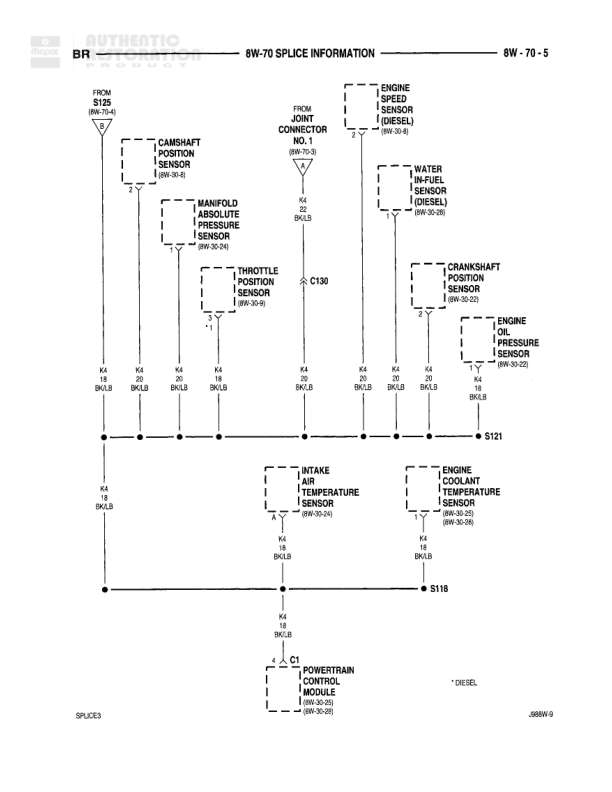

# Splice Information - BR Circuit

**Notes:** This diagram shows the BR circuit splice information, specifically the K4 (BK/LB) sensor ground distribution network. Joint Connector No. 1 reference is 8W-70-8. Some components are diesel-specific. Diagram reference J08BW-9 noted.

## Components

| Component | Ref | Connectors | Notes |
|-----------|-----|------------|-------|
| Camshaft Position Sensor | 8W-30-8 |  | None |
| Manifold Absolute Pressure Sensor | 8W-30-8 |  | None |
| Throttle Position Sensor | 8W-30-25 |  | None |
| Engine Speed Sensor | 8W-30-46 |  | Diesel |
| Water In Fuel Sensor | 8W-30-26 |  | Diesel |
| Crankshaft Position Sensor | 8W-30-23 |  | None |
| Engine Oil Pressure Sensor | 8W-30-23 |  | None |
| Intake Air Temperature Sensor | 8W-30-26 |  | None |
| Engine Coolant Temperature Sensor | 8W-30-26 |  | None |
| Powertrain Control Module | 8W-30-26, 8W-30-28 | C1 | Diesel |

## Wires

| From | To | Wire Code | Gauge | Color | Notes |
|------|-----|-----------|-------|-------|-------|
| S125 | Camshaft Position Sensor | K4 | 18 | BK/LB | None |
| Camshaft Position Sensor | S121 | K4 | 18 | BK/LB | None |
| Joint Connector No. 1 | Manifold Absolute Pressure Sensor | K4 | 22 | BK/LB | None |
| Manifold Absolute Pressure Sensor | S121 | K4 | 18 | BK/LB | None |
| Joint Connector No. 1 | Throttle Position Sensor | K4 | 18 | BK/LB | None |
| Throttle Position Sensor | C130 | K4 | 18 | BK/LB | None |
| C130 | S121 | K4 | 18 | BK/LB | None |
| Engine Speed Sensor | S121 | K4 | 18 | BK/LB | Diesel |
| Water In Fuel Sensor | S121 | K4 | 18 | BK/LB | Diesel |
| Crankshaft Position Sensor | S121 | K4 | 18 | BK/LB | None |
| Engine Oil Pressure Sensor | S121 | K4 | 18 | BK/LB | None |
| S121 | S118 | K4 | 18 | BK/LB | None |
| Intake Air Temperature Sensor | S118 | K4 | 18 | BK/LB | None |
| Engine Coolant Temperature Sensor | S118 | K4 | 18 | BK/LB | None |
| S118 | Powertrain Control Module C1 | K4 | 18 | BK/LB | None |

## Splices & Grounds

| ID | Type | Location | Wires Connected | Notes |
|----|------|----------|-----------------|-------|
| S125 | splice | Initial distribution point | K4 | From 8W-30-8 |
| S121 | splice | Main distribution splice for sensors | K4 | Connects multiple sensor grounds |
| S118 | splice | Secondary distribution point | K4 | Connects to PCM and additional sensors |

## Cross-References

- 8W-30-8
- 8W-30-23
- 8W-30-25
- 8W-30-26
- 8W-30-28
- 8W-30-46
