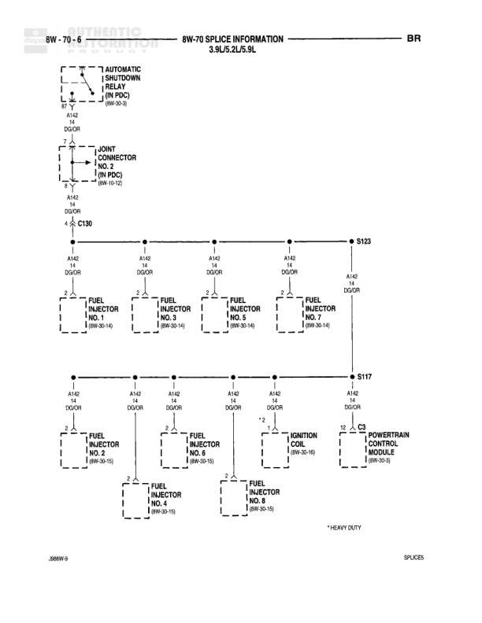

# 8W-70 SPLICE INFORMATION - 3.9L/5.2L/5.9L

**Notes:** Splice information for 3.9L/5.2L/5.9L engines. Fuel Injector No. 7 and No. 8 are HEAVY DUTY applications only. Wire A142 is 14 gauge DG/OR (Dark Green with Orange tracer) throughout.

## Components

| Component | Ref | Connectors | Notes |
|-----------|-----|------------|-------|
| Automatic Shutdown Relay | 8W-30-3 | C130 | IN PDC |
| Joint Connector No. 2 | 8W-10-10 |  | IN PDC |
| Fuel Injector No. 1 | 8W-30-13 |  | None |
| Fuel Injector No. 3 | 8W-30-14 |  | None |
| Fuel Injector No. 5 | 8W-30-16 |  | None |
| Fuel Injector No. 7 | 8W-30-14 |  | HEAVY DUTY |
| Fuel Injector No. 2 | 8W-30-13 |  | None |
| Fuel Injector No. 4 | 8W-30-14 |  | None |
| Fuel Injector No. 6 | 8W-30-15 |  | None |
| Fuel Injector No. 8 | 8W-30-15 |  | None |
| Ignition Coil | 8W-30-16 |  | None |
| Powertrain Control Module | 8W-30-3 |  | None |

## Wires

| From | To | Wire Code | Gauge | Color | Notes |
|------|-----|-----------|-------|-------|-------|
| Automatic Shutdown Relay | C130 | A142 | 14 | DG/OR | None |
| Joint Connector No. 2 | C130 | A142 | 14 | DG/OR | None |
| C130 | S123 | A142 | 14 | DG/OR | None |
| S123 | Fuel Injector No. 1 | A142 | 14 | DG/OR | None |
| S123 | Fuel Injector No. 3 | A142 | 14 | DG/OR | None |
| S123 | Fuel Injector No. 5 | A142 | 14 | DG/OR | None |
| S123 | Fuel Injector No. 7 | A142 | 14 | DG/OR | None |
| S123 | S117 | A142 | 14 | DG/OR | None |
| S117 | Fuel Injector No. 2 | A142 | 14 | DG/OR | None |
| S117 | Fuel Injector No. 4 | A142 | 14 | DG/OR | None |
| S117 | Fuel Injector No. 6 | A142 | 14 | DG/OR | None |
| S117 | Fuel Injector No. 8 | A142 | 14 | DG/OR | None |
| S117 | Ignition Coil | A142 | 14 | DG/OR | None |
| S117 | Powertrain Control Module | A142 | 14 | DG/OR | None |

## Splices & Grounds

| ID | Type | Location | Wires Connected | Notes |
|----|------|----------|-----------------|-------|
| S123 | splice | Between C130 and fuel injectors | A142 | Distributes power to odd-numbered injectors and continues to S117 |
| S117 | splice | Between injector groups | A142 | Distributes power to even-numbered injectors, ignition coil, and PCM |

## Cross-References

- 8W-30-3
- 8W-30-13
- 8W-30-14
- 8W-30-15
- 8W-30-16
- 8W-10-10
