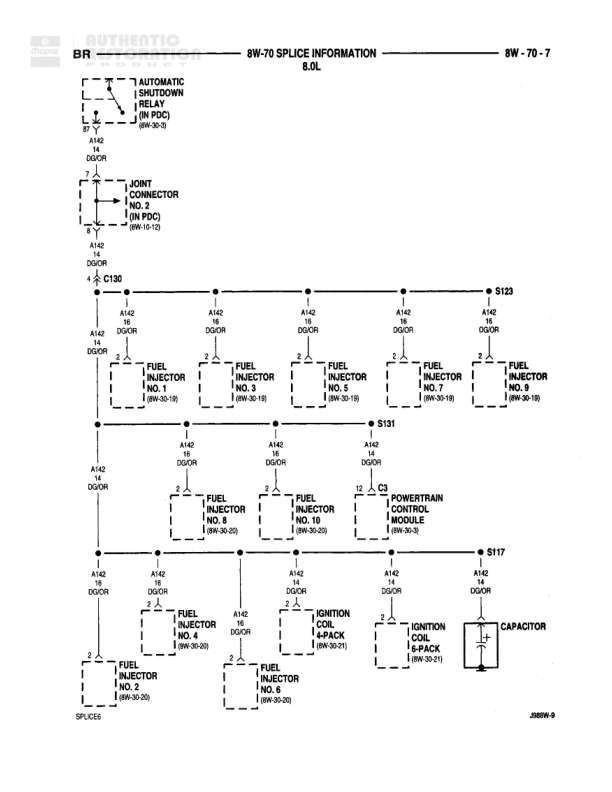

# BR SPLICE INFORMATION - 8.0L

**Notes:** This diagram shows the BR (Brake Controls) circuit power distribution for the 8.0L engine fuel injection and ignition system. Circuit A142 (Battery Feed, part 142, Dark Green with Orange tracer) distributes power from the Automatic Shutdown Relay through multiple splices to all 10 fuel injectors, the PCM, both ignition coil 6-packs, and a capacitor. The distribution uses three main splices: S123 for odd-numbered injectors, S131 for injectors 8 and 10 plus PCM, and S117 for even-numbered injectors and ignition components.

## Components

| Component | Ref | Connectors | Notes |
|-----------|-----|------------|-------|
| Automatic Shutdown Relay | IN PDC (8W-50-3) |  | Located in Power Distribution Center |
| Joint Connector No. 2 | IN PDC (8W-10-13) |  | Located in Power Distribution Center |
| Fuel Injector No. 1 | 8W-30-19 |  |  |
| Fuel Injector No. 3 | 8W-30-18 |  |  |
| Fuel Injector No. 5 | 8W-30-19 |  |  |
| Fuel Injector No. 7 | 8W-30-18 |  |  |
| Fuel Injector No. 9 | 8W-30-19 |  |  |
| Fuel Injector No. 8 | 8W-30-20 |  |  |
| Fuel Injector No. 10 | 8W-30-20 |  |  |
| Powertrain Control Module | 8W-30-3 | C3 |  |
| Fuel Injector No. 4 | 8W-30-20 |  |  |
| Fuel Injector No. 2 | 8W-30-20 |  |  |
| Fuel Injector No. 6 | 8W-30-20 |  |  |
| Ignition Coil 6-Pack | 8W-30-21 |  |  |
| Ignition Coil 6-Pack | 8W-30-21 |  | Second 6-pack |
| Capacitor |  |  |  |

## Wires

| From | To | Wire Code | Gauge | Color | Notes |
|------|-----|-----------|-------|-------|-------|
| Automatic Shutdown Relay | A142 1/4 DOOR | A142 | 14 | DG/OR |  |
| Joint Connector No. 2 | A142 DOOR | A142 | None | DG/OR |  |
| A142 DOOR | C130 | A142 | None | DG/OR |  |
| C130 | S123 | A142 | None | DG/OR | Main distribution line with multiple taps |
| S123 | Fuel Injector No. 1 | A142 | None | DG/OR |  |
| S123 | Fuel Injector No. 3 | A142 | None | DG/OR |  |
| S123 | Fuel Injector No. 5 | A142 | None | DG/OR |  |
| S123 | Fuel Injector No. 7 | A142 | None | DG/OR |  |
| S123 | Fuel Injector No. 9 | A142 | None | DG/OR |  |
| S123 area | S131 | A142 | None | DG/OR |  |
| S131 | Fuel Injector No. 8 | A142 | None | DG/OR |  |
| S131 | Fuel Injector No. 10 | A142 | None | DG/OR |  |
| S131 | Powertrain Control Module C3 | A142 | None | DG/OR |  |
| S131 area | S117 | A142 | None | DG/OR |  |
| S117 | Fuel Injector No. 4 | A142 | None | DG/OR |  |
| S117 | Fuel Injector No. 2 | A142 | None | DG/OR |  |
| S117 | Fuel Injector No. 6 | A142 | None | DG/OR |  |
| S117 | Ignition Coil 6-Pack | A142 | None | DG/OR |  |
| S117 | Ignition Coil 6-Pack (second) | A142 | None | DG/OR |  |
| S117 | Capacitor | A142 | None | DG/OR |  |

## Splices & Grounds

| ID | Type | Location | Wires Connected | Notes |
|----|------|----------|-----------------|-------|
| C130 | connector | In-line connector between ASD relay circuit and main distribution | A142 |  |
| S123 | splice | Distribution point for fuel injectors 1, 3, 5, 7, 9 | A142 | Feeds odd-numbered injectors on one bank |
| S131 | splice | Distribution point for fuel injectors 8, 10 and PCM | A142 |  |
| S117 | splice | Distribution point for fuel injectors 2, 4, 6 and ignition coils | A142 | Feeds even-numbered injectors and ignition system |

## Cross-References

- 8W-50-3
- 8W-10-13
- 8W-30-19
- 8W-30-18
- 8W-30-20
- 8W-30-3
- 8W-30-21
