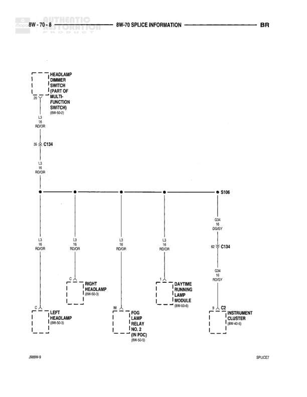

# SPLICE INFORMATION

**Notes:** This diagram shows splice S106 which distributes the high beam circuit (L3) from the headlamp dimmer switch to multiple components. Also shows G34 circuit from DRL module to instrument cluster.

## Components

| Component | Ref | Connectors | Notes |
|-----------|-----|------------|-------|
| HEADLAMP DIMMER SWITCH (PART OF MULTI-FUNCTION SWITCH) | 8W-90-2 | C134 | Part of multi-function switch |
| LEFT HEADLAMP | 8W-90-8 |  | None |
| RIGHT HEADLAMP | 8W-90-2 |  | None |
| FOG LAMP RELAY NO. 2 | 8W-92-1C |  | None |
| DAYTIME RUNNING LAMP MODULE | 8W-90-8 | C134 | None |
| INSTRUMENT CLUSTER | 8W-40-5 | C2 | None |

## Wires

| From | To | Wire Code | Gauge | Color | Notes |
|------|-----|-----------|-------|-------|-------|
| HEADLAMP DIMMER SWITCH Pin 38 | C134 | L3 | 18 | RD/OR | None |
| C134 | S106 | L3 | 18 | RD/OR | None |
| S106 | LEFT HEADLAMP | L3 | 18 | RD/OR | None |
| S106 | RIGHT HEADLAMP | L3 | 18 | RD/OR | None |
| S106 | FOG LAMP RELAY NO. 2 | L3 | 18 | RD/OR | None |
| S106 | DAYTIME RUNNING LAMP MODULE Pin 62 | L3 | 18 | RD/OR | None |
| DAYTIME RUNNING LAMP MODULE Pin 62 | C134 | G34 | 18 | RD/GY | None |
| C134 | INSTRUMENT CLUSTER | G34 | 18 | RD/GY | None |

## Splices & Grounds

| ID | Type | Location | Wires Connected | Notes |
|----|------|----------|-----------------|-------|
| S106 | splice | Central junction point for L3 circuit | L3 | Distributes high beam signal to headlamps, fog lamp relay, and DRL module |

## Cross-References

- 8W-90-2
- 8W-90-8
- 8W-92-1C
- 8W-40-5
