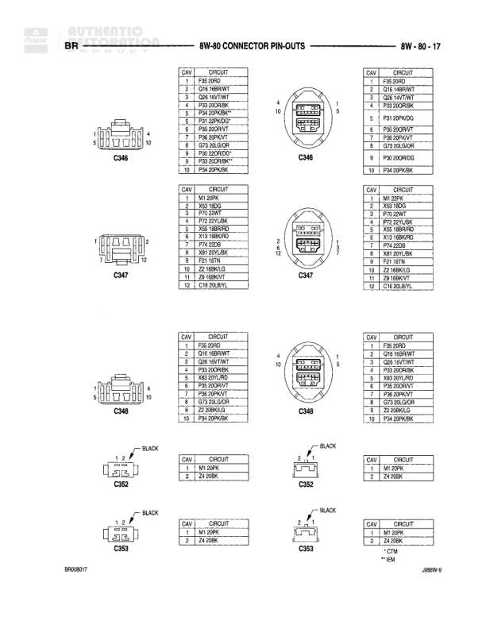

# 8W-80 CONNECTOR PIN-OUTS

**Notes:** This is an index page listing connector pin-out locations throughout section 8W-80. It references components alphabetically with their corresponding diagram page numbers.

## Components

| Component | Ref | Connectors | Notes |
|-----------|-----|------------|-------|
| 4x4 Switch | 8W-80-5 |  |  |
| A/C Blower Switch | 8W-80-5 |  |  |
| A/C Heater Control | 8W-80-5 |  |  |
| A/C High Pressure Switch | 8W-80-5 |  |  |
| A/C Low Pressure Switch | 8W-80-6 |  |  |
| Airbag Control Module | 8W-80-6 |  |  |
| Ambient Temperature Sensor | 8W-80-6 |  |  |
| Ash Receiver Lamp | 8W-80-7 |  |  |
| Auxiliary Battery | 8W-80-7 |  |  |
| Battery Temperature Sensor | 8W-80-7 |  |  |
| Blower Motor | 8W-80-8 |  |  |
| Blower Motor Resistor Block | 8W-80-8 |  |  |
| Brake Pressure Switch | 8W-80-8 |  |  |
| Bulb Jumper | 8W-80-8 |  |  |
| C106 | 8W-80-9 | C106 |  |
| C106 | 8W-80-9 | C106 |  |
| C114 | 8W-80-9 | C114 |  |
| C119 | 8W-80-9 | C119 |  |
| C125 | 8W-80-10 | C125 |  |
| C126 | 8W-80-10 | C126 |  |
| C127 | 8W-80-11 | C127 |  |
| C129 | 8W-80-11 | C129 |  |
| C130 | 8W-80-11, 12 | C130 |  |
| C134 | 8W-80-13, 14 | C134 |  |
| C188 | 8W-80-14 | C188 |  |
| C203 | 8W-80-15 | C203 |  |
| C204 | 8W-80-15 | C204 |  |
| C237 | 8W-80-15 | C237 |  |
| C303 | 8W-80-15 | C303 |  |
| C308 | 8W-80-15 | C308 |  |
| C329 | 8W-80-16 | C329 |  |
| C333 | 8W-80-16 | C333 |  |
| C342 | 8W-80-16 | C342 |  |
| C343 | 8W-80-16 | C343 |  |
| C345 | 8W-80-16 | C345 |  |
| C346 | 8W-80-17 | C346 |  |
| C347 | 8W-80-17 | C347 |  |
| C352 | 8W-80-17 | C352 |  |
| C352 | 8W-80-17 | C352 |  |
| C353 | 8W-80-17 | C353 |  |
| C360 | 8W-80-18 | C360 |  |
| C361 | 8W-80-18 | C361 |  |
| C362 | 8W-80-18 | C362 |  |
| C363 | 8W-80-18 | C363 |  |
| C364 | 8W-80-18 | C364 |  |
| Camshaft Position Sensor | 8W-80-19 |  |  |
| Cargo Lamp No. 1 | 8W-80-19 |  |  |
| Cargo Lamp No. 2 | 8W-80-19 |  |  |
| Center High Mounted Stop Lamp No. 1 | 8W-80-19 |  |  |
| Center High Mounted Stop Lamp No. 2 | 8W-80-19 |  |  |
| Center Identification Lamp | 8W-80-19 |  |  |
| Central Timer Module | 8W-80-20 |  |  |
| Cigar Lighter | 8W-80-20 |  |  |
| Clutch Pedal Position Switch | 8W-80-20 |  |  |
| Controller Anti-Lock Brake -C1 | 8W-80-20 |  |  |
| Controller Anti-Lock Brake -C2 | 8W-80-21 |  |  |
| Crankshaft Position Sensor | 8W-80-21 |  |  |
| Cup Holder Lamp | 8W-80-22 |  |  |
| Data Link Connector | 8W-80-22 |  |  |
| Day/Night Mirror | 8W-80-22 |  |  |
| Daytime Running Lamp Module | 8W-80-22 |  |  |
| Distributor | 8W-80-23 |  |  |
| Downstream Heated Oxygen Sensor | 8W-80-23 |  |  |
| Driver Airbag | 8W-80-23 |  |  |
| Driver Seat Solenoid | 8W-80-23 |  |  |
| Duty Cycle Evap/Purge Solenoid | 8W-80-24 |  |  |
| EGR Solenoid | 8W-80-24 |  |  |
| Electric Brake | 8W-80-24 |  |  |
| Engine Coolant Temperature Sensor | 8W-80-24 |  |  |
| Engine Oil Pressure Sensor | 8W-80-25 |  |  |
| Engine Starter Motor | 8W-80-25 |  |  |
