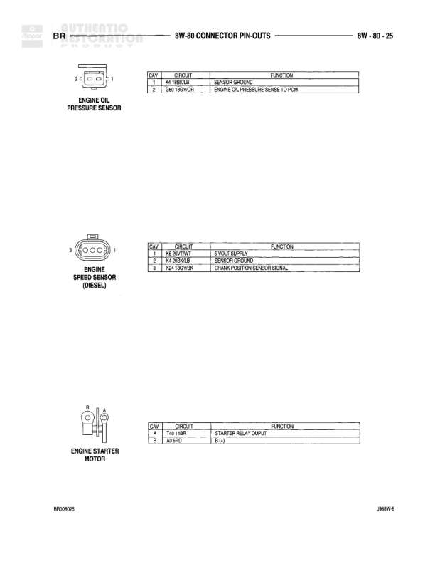

# 8W-80 CONNECTOR PIN-OUTS

**Notes:** This diagram shows connector pin-outs for connectors C128, C129, C130, and C130 (IN PDC). The C130 (IN PDC) variant is marked as DIESEL and is a 43-pin connector in the Power Distribution Center. Standard C130 is an 18-pin connector. Reference code BR080HR11 appears at bottom.

## Components

| Component | Ref | Connectors | Notes |
|-----------|-----|------------|-------|
| Connector C128 | C128 | C128 | 8-pin connector |
| Connector C129 | C129 | C129 | 8-pin connector |
| Connector C130 | C130 | C130 | 18-pin connector |
| Connector C130 (IN PDC) | C130 | C130 | 43-pin connector, IN PDC (Power Distribution Center), DIESEL variant |

## Wires

| From | To | Wire Code | Gauge | Color | Notes |
|------|-----|-----------|-------|-------|-------|
| C128 | Pin 1 | B113 | None | DG/VT | Connector C128, Cavity 1 |
| C128 | Pin 2 | B112 | None | GY/WT | Connector C128, Cavity 2 |
| C128 | Pin 3 | Z13 | None | BK | Connector C128, Cavity 3 |
| C128 | Pin 6 | B112 | None | GY/WT | Connector C128, Cavity 6 |
| C128 | Pin 7 | K4 | None | ZS/BK/LB | Connector C128, Cavity 7 |
| C128 | Pin 8 | K258 | None | DG/WT | Connector C128, Cavity 8 |
| C129 | Pin 1 | L7 | None | DB/YL | Connector C129, Cavity 1 |
| C129 | Pin 3 | L78 | None | DB/OR | Connector C129, Cavity 3 |
| C129 | Pin 4 | L83 | None | DG/RD | Connector C129, Cavity 4 |
| C129 | Pin 5 | L1 | None | BK/OR | Connector C129, Cavity 5 |
| C129 | Pin 6 | L82 | None | YL/BK | Connector C129, Cavity 6 |
| C129 | Pin 7 | L82 | None | YL/BK | Connector C129, Cavity 7 |
| C129 | Pin 8 | A81 | None | DG/BK | Connector C129, Cavity 8 |
| C130 | Pin 1 | V35 | None | BL/RD | Connector C130, Cavity 1 |
| C130 | Pin 2 | V35 | None | BK/RD | Connector C130, Cavity 2 |
| C130 | Pin 3 | K140 | None | TN/RD | Connector C130, Cavity 3 |
| C130 | Pin 4 | A142 | None | DG/OR | Connector C130, Cavity 4 |
| C130 | Pin 5 | T45 | None | DB/BK | Connector C130, Cavity 5 |
| C130 | Pin 6 | A93 | None | DB/OR | Connector C130, Cavity 6 |
| C130 | Pin 7 | K118 | None | BR/YL | Connector C130, Cavity 7 |
| C130 | Pin 8 | L1 | None | BK/BK | Connector C130, Cavity 8 |
| C130 | Pin 9 | G85 | None | DB/OR | Connector C130, Cavity 9 |
| C130 | Pin 10 | L42 | None | BK/PK | Connector C130, Cavity 10 |
| C130 | Pin 11 | L78 | None | DB/LB | Connector C130, Cavity 11 |
| C130 | Pin 13 | L11 | None | VT/BK | Connector C130, Cavity 13 |
| C130 | Pin 14 | A51 | None | VT/YL | Connector C130, Cavity 14 |
| C130 | Pin 15 | C13 | None | GR/YL | Connector C130, Cavity 15 |
| C130 | Pin 16 | L111 | None | BK/YL | Connector C130, Cavity 16 |
| C130 | Pin 17 | D2 | None | VT/OR | Connector C130, Cavity 17 |
| C130 | Pin 18 | K4 | None | DB/LB | Connector C130, Cavity 18 |
| C130 (IN PDC) | Pin 1 | V35 | None | DG/RD | Connector C130 IN PDC, Cavity 1, DIESEL |
| C130 (IN PDC) | Pin 2 | V35 | None | GY/RD | Connector C130 IN PDC, Cavity 2, DIESEL |
| C130 (IN PDC) | Pin 3 | K140 | None | TN/RD | Connector C130 IN PDC, Cavity 3, DIESEL |
| C130 (IN PDC) | Pin 4 | A142 | None | DG/OR | Connector C130 IN PDC, Cavity 4, DIESEL |
| C130 (IN PDC) | Pin 5 | A142 | None | DB/LG | Connector C130 IN PDC, Cavity 5, DIESEL |
| C130 (IN PDC) | Pin 6 | T45 | None | DB | Connector C130 IN PDC, Cavity 6, DIESEL |
| C130 (IN PDC) | Pin 7 | A93 | None | DB/OR | Connector C130 IN PDC, Cavity 7, DIESEL |
| C130 (IN PDC) | Pin 8 | K22 | None | RD/YBK | Connector C130 IN PDC, Cavity 8, DIESEL |
| C130 (IN PDC) | Pin 9 | K22 | None | GY/DB | Connector C130 IN PDC, Cavity 9, DIESEL |
| C130 (IN PDC) | Pin 10 | K120 | None | DB/WT | Connector C130 IN PDC, Cavity 10, DIESEL |
| C130 (IN PDC) | Pin 11 | G85 | None | DG/BK | Connector C130 IN PDC, Cavity 11, DIESEL |
| C130 (IN PDC) | Pin 12 | L42 | None | BK/PK | Connector C130 IN PDC, Cavity 12, DIESEL |
| C130 (IN PDC) | Pin 13 | L78 | None | DB/LB | Connector C130 IN PDC, Cavity 13, DIESEL |
| C130 (IN PDC) | Pin 14 | R2 | None | RD/BYL | Connector C130 IN PDC, Cavity 14, DIESEL |
| C130 (IN PDC) | Pin 15 | C13 | None | GY/OR | Connector C130 IN PDC, Cavity 15, DIESEL |
| C130 (IN PDC) | Pin 16 | L111 | None | BK/YL | Connector C130 IN PDC, Cavity 16, DIESEL |
| C130 (IN PDC) | Pin 17 | D2 | None | GY/BK | Connector C130 IN PDC, Cavity 17, DIESEL |
| C130 (IN PDC) | Pin 18 | K4 | None | DB/LB | Connector C130 IN PDC, Cavity 18, DIESEL |
| C130 (IN PDC) | Pin 19 | K4 | None | DB/LB | Connector C130 IN PDC, Cavity 19, DIESEL |
