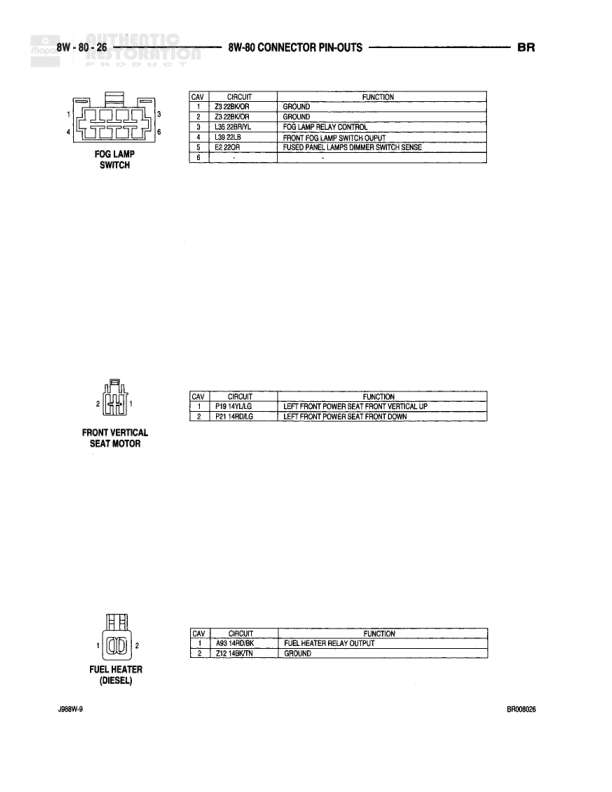

# 8W-80 CONNECTOR PIN-OUTS - BR (CONTINUED)

**Notes:** This page shows connector pin-out assignments for C130 located in the Power Distribution Center (PDC). Pin assignments include various circuits: C (Climate Controls), D (Diagnostic), K (Powertrain Control), F (Fused), T (Transmission), A (Battery Feed), Z (Ground), and others. Legend indicates: * DIESEL, ^ GAS, *** M/V/B, ● M/T, ●● M/T, # HEAVY DUTY

## Components

| Component | Ref | Connectors | Notes |
|-----------|-----|------------|-------|
| C130 (IN PDC) | 8W-80-12 | C130 | Power Distribution Center connector with 42 pins listed |
