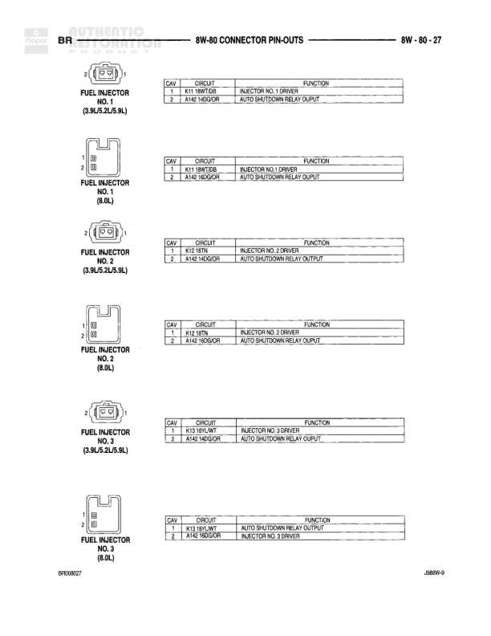

# 8W-80 CONNECTOR PIN-OUTS

**Notes:** Reference diagram showing cavity assignments and circuit designations for 8W-80 connector C134. Pin-out table shows continued circuits from other diagram pages. Diagram includes both Continued and Diesel specific circuits. Some cavities are unused/blank.

## Components

| Component | Ref | Connectors | Notes |
|-----------|-----|------------|-------|
| 8W-80 Connector | C134 | C134 | Black connector shown from two views with cavity numbering |

## Cross-References

- 8W-80-13
