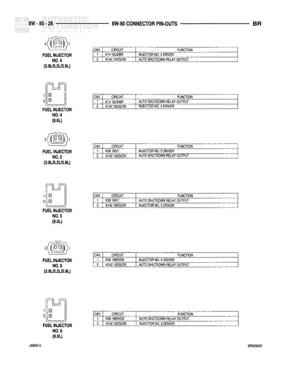

# BR Connector Pin-Outs

**Notes:** This is a connector pin-out reference diagram showing the cavity assignments and circuits for various connectors in the BR system. Connectors shown: C203 (30-pin), C204 (3-pin), C207 (4-pin), C303 (2-pin), and C308 (6-pin). The diagram provides circuit assignments for each cavity but does not show actual wiring connections between components. Connector C203 pin assignments include: Cav 13=Q111 16LG/BK, 14=Q82 16TNOR, 15=Q75 20TN, 16=F35 20RD, 17=A56 18RDYL, 21=X54 18VT, 22=X56 16DB/RD, 23=X53 16DG, 24=X63 18BR/RD, 25=X62 18RD/BK, 26=F34 20PK/BK. Connector C204 assignments: Cav 1=P91 22RD/DB, 2=P91 22PK/DG, 3=P93 22LG/BK. Connector C207 assignments: Cav 1=Q7 DB/WT/N, 2=Q8 14LB, 3=Q5 16LG, 4=Q4 16TN. Connector C303 assignments: Cav 1=Z3 18BR/OR, 2=F37 14RD/LB. Connector C308 assignments: Cav 1=L26 16WT/TN, 2=Z2 20PK/LG, 3=M1 20PK, 4=M3 20PK/OR, 5-6=blank. Additional C308 view shows: Cav 1=L09 16WT/TN, 2=Z1 18OR/PK, 3=Z3 18BR/OR, 4=Z3 18BR/OR, 5=M3 20PK/OR, 6=M1 18PK, 7=M3 18PK/OR, 8=M3 18PK/OR.

## Components

| Component | Ref | Connectors | Notes |
|-----------|-----|------------|-------|
| Connector C203 | C203 | C203 | 30-pin connector |
| Connector C204 | C204 | C204 | 3-pin connector |
| Connector C207 | C207 | C207 | 4-pin connector |
| Connector C303 | C303 | C303 | 2-pin connector |
| Connector C308 | C308 | C308 | 6-pin connector |
