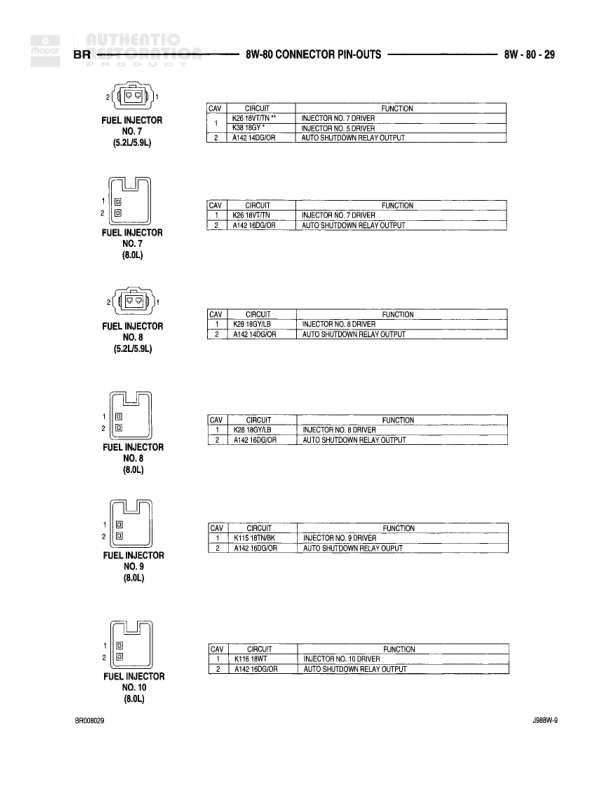

# 8W-80 Connector Pin-Outs

**Notes:** Pin-out reference page showing connector diagrams for C329, C333, C342, C343, and C345. C345 has both MID-LINE and HIGH-LINE variants with differences in Pin 10 (MID-LINE: Z9 18BK/LG) and Pin 11 (HIGH-LINE: Z9 18BK/WT). Document identifiers shown: J0269W-9 and 8PG048/16

## Components

| Component | Ref | Connectors | Notes |
|-----------|-----|------------|-------|
| Connector C329 | C329 | C329 | 4-pin connector |
| Connector C333 | C333 | C333 | 4-pin connector |
| Connector C342 | C342 | C342 | 2-pin connector |
| Connector C343 | C343 | C343 | 2-pin connector |
| Connector C345 | C345 | C345 | 12-pin connector, MID-LINE and HIGH-LINE variants shown |

## Wires

| From | To | Wire Code | Gauge | Color | Notes |
|------|-----|-----------|-------|-------|-------|
| C329 | Pin 1 | L7 | 18 | BK/YL | Connector C329 pinout |
| C329 | Pin 2 | Z13 | 18 | BK | Connector C329 pinout |
| C329 | Pin 3 | L62 | 18 | RD/BK | Connector C329 pinout |
| C329 | Pin 4 | L1 | 18 | YL/BK | Connector C329 pinout |
| C329 (Right) | Pin 1 | L7 | 18 | BK/YL | Connector C329 right side pinout |
| C329 (Right) | Pin 2 | Z13 | 18 | BK | Connector C329 right side pinout |
| C329 (Right) | Pin 3 | L62 | 18 | RD/BK | Connector C329 right side pinout |
| C329 (Right) | Pin 4 | L1 | 18 | YL/BK | Connector C329 right side pinout |
| C333 | Pin 1 | L7 | 18 | BK/YL | Connector C333 pinout |
| C333 | Pin 2 | Z13 | 18 | BK | Connector C333 pinout |
| C333 | Pin 3 | L63 | 18 | RD/OR | Connector C333 pinout |
| C333 | Pin 4 | L1 | 18 | YL/BK | Connector C333 pinout |
| C333 (Right) | Pin 1 | L7 | 18 | BK/YL | Connector C333 right side pinout |
| C333 (Right) | Pin 2 | Z13 | 18 | BK | Connector C333 right side pinout |
| C333 (Right) | Pin 3 | L63 | 18 | RD/OR | Connector C333 right side pinout |
| C333 (Right) | Pin 4 | L1 | 18 | YL/BK | Connector C333 right side pinout |
| C342 | Pin 1 | Z13 | 18 | BK | Connector C342 pinout |
| C342 | Pin 2 | L7 | 18 | BK/YL | Connector C342 pinout |
| C342 (Right) | Pin 1 | Z13 | 18 | BK | Connector C342 right side pinout |
| C342 (Right) | Pin 2 | L7 | 18 | BK/YL | Connector C342 right side pinout |
| C343 | Pin 1 | Z13 | 18 | BK | Connector C343 pinout |
| C343 | Pin 2 | L7 | 18 | BK/YL | Connector C343 pinout |
| C343 (Right) | Pin 1 | Z13 | 18 | BK | Connector C343 right side pinout |
| C343 (Right) | Pin 2 | L7 | 18 | BK/YL | Connector C343 right side pinout |
| C345 | Pin 1 | X62 | 20 | LB/RD | Connector C345 pinout |
| C345 | Pin 2 | X13 | 20 | BK/LG | Connector C345 pinout |
| C345 | Pin 3 | P72 | 22 | WT | Connector C345 pinout |
| C345 | Pin 4 | P72 | 20 | WT/LBK | Connector C345 pinout |
| C345 | Pin 5 | X13 | 18 | BK/RD | Connector C345 pinout |
| C345 | Pin 6 | X13 | 18 | BK/RD | Connector C345 pinout |
| C345 | Pin 7 | P72 | 18 | BK | Connector C345 pinout |
| C345 | Pin 8 | X62 | 20 | LB/BK | Connector C345 pinout |
| C345 | Pin 9 | X21 | None | RD/YL | Connector C345 pinout |
| C345 | Pin 10 | Z9 | 18 | BK/LG | Connector C345 pinout |
| C345 | Pin 11 | Z9 | 18 | BK/YT | Connector C345 pinout |
| C345 | Pin 12 | D12 | 20 | LG/YL | Connector C345 pinout |
| C345 (Right) | Pin 1 | X62 | 20 | LB/RD | Connector C345 right side pinout |
| C345 (Right) | Pin 2 | X13 | 20 | BK/LG | Connector C345 right side pinout |
| C345 (Right) | Pin 3 | P72 | 22 | WT | Connector C345 right side pinout |
| C345 (Right) | Pin 4 | P72 | 20 | WT/LBK | Connector C345 right side pinout |
| C345 (Right) | Pin 5 | X13 | 18 | BK/RD | Connector C345 right side pinout |
| C345 (Right) | Pin 6 | X13 | 18 | BK/RD | Connector C345 right side pinout |
| C345 (Right) | Pin 7 | P72 | 18 | BK | Connector C345 right side pinout |
| C345 (Right) | Pin 8 | X62 | 20 | LB/BK | Connector C345 right side pinout |
| C345 (Right) | Pin 9 | X21 | None | RD/YL | Connector C345 right side pinout |
| C345 (Right) | Pin 10 | Z9 | 18 | BK/LG | Connector C345 right side pinout, MID-LINE |
| C345 (Right) | Pin 11 | Z9 | 18 | BK/WT | Connector C345 right side pinout, HIGH-LINE |
| C345 (Right) | Pin 12 | D12 | 20 | LG/YL | Connector C345 right side pinout |
