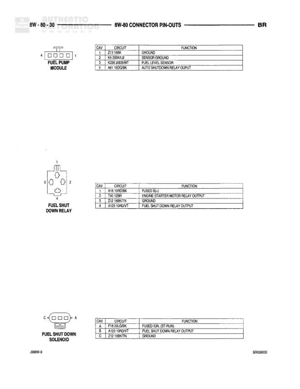

# 8W-80 CONNECTOR PIN-OUTS

**Notes:** This is a connector pin-out reference page showing the cavity assignments and wire circuits for connectors C46, C47, C48, C352, and C353. C46 and C48 have identical pin assignments. C352 and C353 are BCM connectors. ** indicates certain pin assignments may vary.

## Components

| Component | Ref | Connectors | Notes |
|-----------|-----|------------|-------|
| Connector C46 | C46 | C46 | 10-pin connector |
| Connector C47 | C47 | C47 | 12-pin connector |
| Connector C48 | C48 | C48 | 10-pin connector |
| Connector C352 | C352 | C352 | 2-pin connector, BLACK |
| Connector C353 | C353 | C353 | 2-pin connector, BLACK, BCM |
