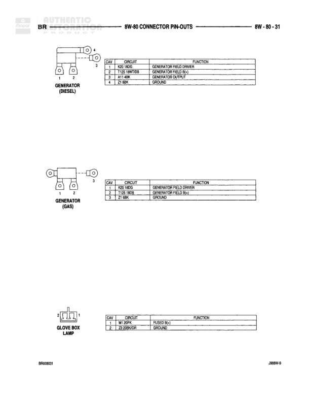

# 8W-80 Connector Pin-Outs

**Notes:** This diagram shows connector pin-out assignments for connectors C360, C361, C362, C363, and C364. Circuit assignments include: F10 18RD, M1 20PK, B2A 12TN/RD, F15 16DB/WT, A79 20GY/WT, B12 20TN, Z2 18BK/LG, F87 18RD/LG, P4 20LG, G111 18LG/BK, M37 16BR/LG, X63 18BR/YL, Q10 20LG/RD, F12 16LG/WT, X82 18DB/WT, B7 18OG/BK, Z6 18BK/LG, N8 18OG/RD, X48 18DG/OR, X52 18DB/WT.

## Components

| Component | Ref | Connectors | Notes |
|-----------|-----|------------|-------|
| Connector C360 | C360 | C360 | 10-pin connector |
| Connector C360 (mating) | C360 | C360 | 10-pin connector, mating side |
| Connector C361 | C361 | C361 | 6-pin connector |
| Connector C361 (mating) | C361 | C361 | 6-pin connector, mating side |
| Connector C362 | C362 | C362 | 4-pin connector |
| Connector C362 (mating) | C362 | C362 | 4-pin connector, mating side |
| Connector C363 | C363 | C363 | 2-pin connector |
| Connector C363 (mating) | C363 | C363 | 2-pin connector, mating side |
| Connector C364 | C364 | C364 | 6-pin connector |
| Connector C364 (mating) | C364 | C364 | 6-pin connector, mating side |
