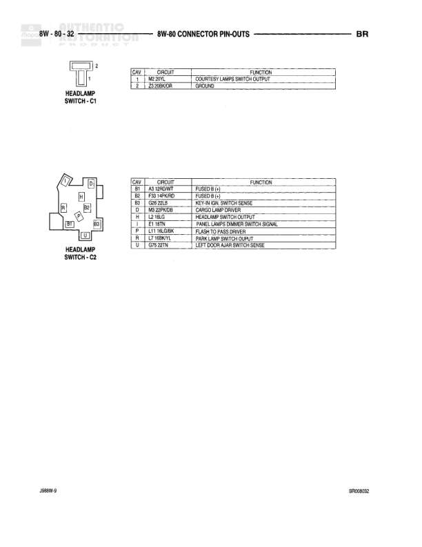

# AUTOMATIC TRANSMISSIONS - 8W-80 CONNECTOR PIN-OUTS

**Notes:** This page shows connector pin-outs for various lamps and the camshaft position sensor. Document reference: BR AUTOMATIC TRANSMISSIONS, 8P0U0819

## Components

| Component | Ref | Connectors | Notes |
|-----------|-----|------------|-------|
| Camshaft Position Sensor | 8W-80-19 | 3-pin connector | 3-pin connector with numbered positions |
| Cargo Lamp No. 1 | 8W-80-19 | 2-pin connector | 2-pin connector |
| Cargo Lamp No. 2 | 8W-80-19 | 2-pin connector | 2-pin connector |
| Center High Mounted Stop Lamp No. 1 | 8W-80-19 | 2-pin connector | 2-pin connector |
| Center High Mounted Stop Lamp No. 2 | 8W-80-19 | 2-pin connector | 2-pin connector |
| Center Identification Lamp | 8W-80-19 | 2-pin connector | 2-pin bulb-style connector |

## Wires

| From | To | Wire Code | Gauge | Color | Notes |
|------|-----|-----------|-------|-------|-------|
| Camshaft Position Sensor Pin 1 | K44 18TN/YL | K44 | 18 | TN/YL | Camshaft Position Sensor Signal |
| Camshaft Position Sensor Pin 2 | K2 20BK/LB | K2 | 20 | BK/LB | Sensor Ground |
| Camshaft Position Sensor Pin 3 | K6 20WT/MT | K6 | 20 | WT | 5V Supply |
| Cargo Lamp No. 1 Pin 1 | M1 18PK | M1 | 18 | PK | Fused B (+) |
| Cargo Lamp No. 1 Pin 2 | M3 18PK/DB | M3 | 18 | PK/DB | Cargo Lamp Driver |
| Cargo Lamp No. 2 Pin 1 | M1 18PK | M1 | 18 | PK | Fused B (+) |
| Cargo Lamp No. 2 Pin 2 | M3 18PK/DB | M3 | 18 | PK/DB | Cargo Lamp Driver |
| Center High Mounted Stop Lamp No. 1 Pin 1 | L56 16WT/TN | L56 | 16 | WT/TN | Stop Lamp Switch Output | BG |
| Center High Mounted Stop Lamp No. 1 Pin 2 | Z3 18BK/OR | Z3 | 18 | BK/OR | Ground |
| Center High Mounted Stop Lamp No. 2 Pin 1 | L56 16WT/TN | L56 | 16 | WT/TN | Stop Lamp Switch Output |
| Center High Mounted Stop Lamp No. 2 Pin 2 | Z3 18BK/OR | Z3 | 18 | BK/OR | Ground |
| Center Identification Lamp Pin 1 | L7 18WT/L | L7 | 18 | WT | Head Lamp Switch Output |
| Center Identification Lamp Pin 2 | Z4 18pk | Z4 | 18 | PK | Ground |
