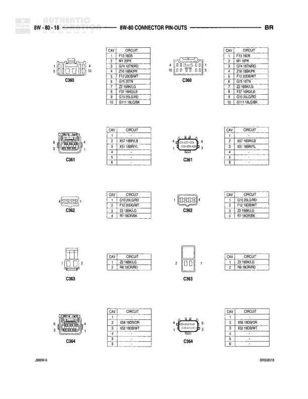

# Connector Pin-Outs Index

**Notes:** This is an index page showing component names and their corresponding page references for connector pin-out diagrams. This page does not contain actual wiring diagrams or connection details.

## Components

| Component | Ref | Connectors | Notes |
|-----------|-----|------------|-------|
| Fog Lamp Switch | 8W-80-26 |  |  |
| Front Vertical Seat Motor | 8W-80-26 |  |  |
| Fuel Heater | 8W-80-26 |  |  |
| Fuel Injector No. 1 | 8W-80-27 |  |  |
| Fuel Injector No. 10 | 8W-80-27 |  |  |
| Fuel Injector No. 2 | 8W-80-27 |  |  |
| Fuel Injector No. 3 | 8W-80-27 |  |  |
| Fuel Injector No. 4 | 8W-80-28 |  |  |
| Fuel Injector No. 5 | 8W-80-28 |  |  |
| Fuel Injector No. 6 | 8W-80-28 |  |  |
| Fuel Injector No. 7 | 8W-80-29 |  |  |
| Fuel Injector No. 8 | 8W-80-29 |  |  |
| Fuel Injector No. 9 | 8W-80-29 |  |  |
| Fuel Pump Module | 8W-80-30 |  |  |
| Fuel Shut Down Relay | 8W-80-30 |  |  |
| Fuel Shut Down Solenoid | 8W-80-30 |  |  |
| Gear Shift Sensor | 8W-80-31 |  |  |
| Glow Box Lamp | 8W-80-31 |  |  |
| Headlamp Switch -C1 | 8W-80-32 |  |  |
| Headlamp Switch -C2 | 8W-80-32 |  |  |
| Heated Mirror Switch | 8W-80-33 |  |  |
| Heated Seat Module | 8W-80-33 |  |  |
| Horizontal Seat Motor | 8W-80-33 |  |  |
| Idle Air Control | 8W-80-34 |  |  |
| Ignition Coil | 8W-80-34 |  |  |
| Ignition Switch -C1 | 8W-80-35 |  |  |
| Ignition Switch -C2 | 8W-80-35 |  |  |
| Instrument Cluster -C1 | 8W-80-35 |  |  |
| Instrument Cluster -C2 | 8W-80-35 |  |  |
| Instrument Cluster -C3 | 8W-80-35 |  |  |
| Intake Air Heater Relay No. 1 | 8W-80-36 |  |  |
| Intake Air Heater Relay No. 2 | 8W-80-36 |  |  |
| Intake Air Temperature Sensor | 8W-80-37 |  |  |
| Integrated Electronic Module | 8W-80-37 |  |  |
| Joint Connector No. 1 | 8W-80-38 |  |  |
| Joint Connector No. 2 | 8W-80-38 |  |  |
| Joint Connector No. 3 | 8W-80-39 |  |  |
| Joint Connector No. 4 | 8W-80-38 |  |  |
| Joint Connector No. 5 | 8W-80-39 |  |  |
| Joint Connector No. 6 | 8W-80-39 |  |  |
| Joint Connector No. 7 | 8W-80-40 |  |  |
| Junction Block C1 | 8W-80-41 |  |  |
| Junction Block C2 | 8W-80-41 |  |  |
| Junction Block C3 | 8W-80-41 |  |  |
| Junction Block C4 | 8W-80-42 |  |  |
| Junction Block C5 | 8W-80-42 |  |  |
| Junction Block C6 | 8W-80-42 |  |  |
| Junction Block C7 | 8W-80-42 |  |  |
| Junction Block C8 | 8W-80-43 |  |  |
| Junction Block C9 | 8W-80-43 |  |  |

## Cross-References

- 8W-80-26
- 8W-80-27
- 8W-80-28
- 8W-80-29
- 8W-80-30
- 8W-80-31
- 8W-80-32
- 8W-80-33
- 8W-80-34
- 8W-80-35
- 8W-80-36
- 8W-80-37
- 8W-80-38
- 8W-80-39
- 8W-80-40
- 8W-80-41
- 8W-80-42
- 8W-80-43
