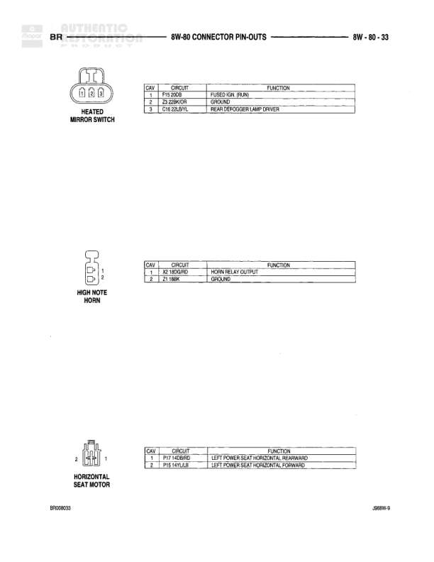

# 8W-80 CONNECTOR PIN-OUTS - BR

**Notes:** This diagram shows connector pin-outs for the Central Timer Module, Cigar Lighter, and Clutch Pedal Position Switch (M/T) for BR variant. Document reference J988X-8 dated 5Y08/2003.

## Components

| Component | Ref | Connectors | Notes |
|-----------|-----|------------|-------|
| CENTRAL TIMER MODULE | C1 | C1 | 18-pin connector with various power, ground, and control circuits |
| CIGAR LIGHTER | 2-pin connector |  | 2-pin connector (pins 1 and 2) |
| CLUTCH PEDAL POSITION SWITCH (M/T) | 2-pin connector |  | 2-pin connector for manual transmission (pins 1 and 2) |

## Wires

| From | To | Wire Code | Gauge | Color | Notes |
|------|-----|-----------|-------|-------|-------|
| CENTRAL TIMER MODULE C1 Pin 1 | RADIO CLOCK | M2 | 22 | PK | RADIO CLOCK circuit |
| CENTRAL TIMER MODULE C1 Pin 2 | COURTESY LAMPS DRIVER | M2 | 22 | PK |  |
| CENTRAL TIMER MODULE C1 Pin 3 | RED FOP DOOR LOCK SWITCH | Z3 | 18 | BK/OR |  |
| CENTRAL TIMER MODULE C1 Pin 4 | POWER GROUND | F20 | 20 | VT/OR |  |
| CENTRAL TIMER MODULE C1 Pin 5 | FUSED IGN. RUN ACC | F32 | 22 | WT |  |
| CENTRAL TIMER MODULE C1 Pin 6 | DOOR LOCK LAMP CONTROL | E15 | 20 | LG/YL |  |
| CENTRAL TIMER MODULE C1 Pin 8 | VTSS INDICATOR LAMP DRIVER | G49 | 22 | BK |  |
| CENTRAL TIMER MODULE C1 Pin 9 | DOOR JAMB SWITCH | M2 | 22 | PK |  |
| CENTRAL TIMER MODULE C1 Pin 10 | KEY DIS/ARM SWITCH | G73 | 22 | LG/YL |  |
| CENTRAL TIMER MODULE C1 Pin 13 | POWER DOOR LOCK MOTOR B(-) UNLOCK | F31 | 22 | PK/DG |  |
| CENTRAL TIMER MODULE C1 Pin 16 | CCU BUS (+) | D1 | 20 | TN/BR |  |
| CENTRAL TIMER MODULE C1 Pin 17 | CCU BUS (-) | D2 | 20 | WT/BK |  |
| CENTRAL TIMER MODULE C1 Pin 18 | HORN RELAY CONTROL | K3 | 22 | BR/RD |  |
| CIGAR LIGHTER Pin 1 | FUSED 12A (RUN, ACC) | F35 | 18 | RD/OR |  |
| CIGAR LIGHTER Pin 3 | GROUND | Z3 | 18 | BK/OR |  |
| CLUTCH PEDAL POSITION SWITCH (M/T) Pin 1 | IGN. SWITCH OUTPUT (RUN) | F14 | 14 | WT/TN |  |
| CLUTCH PEDAL POSITION SWITCH (M/T) Pin 2 | IGN. SWITCH OUTPUT (B+) | A41 | 14 | YL |  |
